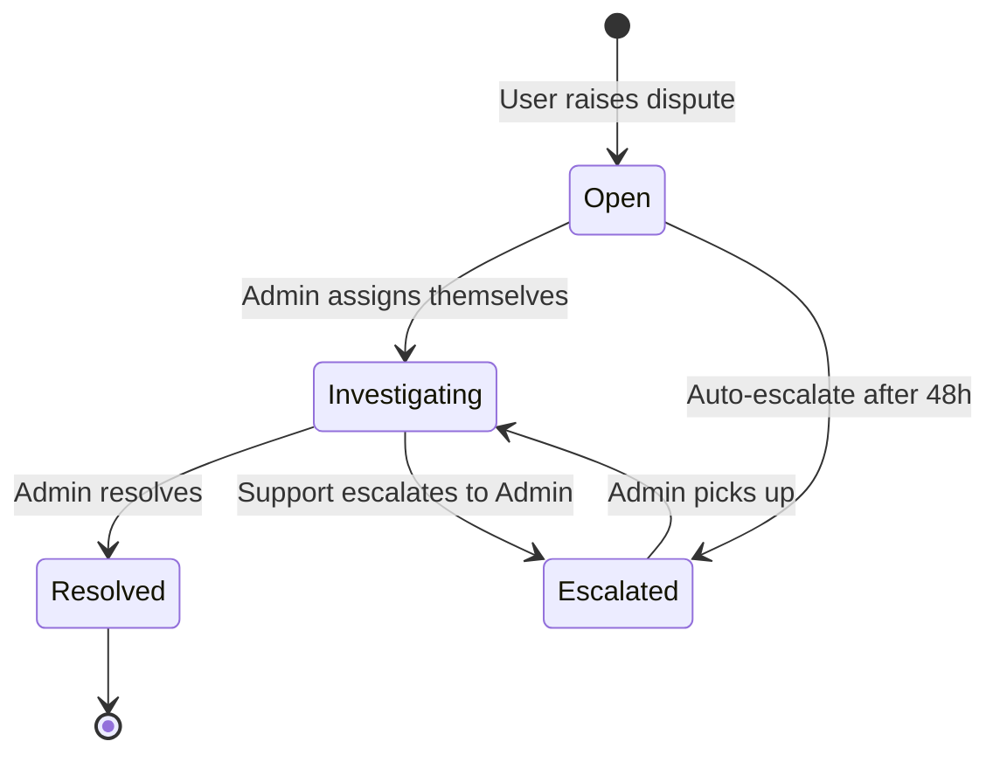

# Admin Portal — Operational Control Center Specification

## 1. Admin RBAC Hierarchy

### 1.1 Role Definitions

| Role | Level | Capabilities | Assignment |
|------|-------|-------------|------------|
| **Owner** | 1 (highest) | Full platform control; manage all admins; configure commission; delete data; access financials | Hardcoded at deployment (1-2 people) |
| **Admin** | 2 | User management; vendor verification; dispute resolution; job moderation; view financials | Assigned by Owner |
| **Support** | 3 (lowest) | View-only dashboards; add dispute notes; escalate to Admin; read audit log | Assigned by Owner or Admin |

### 1.2 Permission Matrix

| Action | Owner | Admin | Support |
|--------|-------|-------|---------|
| View dashboard KPIs | ✅ | ✅ | ✅ |
| View user profiles | ✅ | ✅ | ✅ |
| Suspend/unsuspend users | ✅ | ✅ | ❌ |
| Delete users (GDPR) | ✅ | ❌ | ❌ |
| Verify/reject vendors | ✅ | ✅ | ❌ |
| Moderate jobs (hide/remove) | ✅ | ✅ | ❌ |
| View disputes | ✅ | ✅ | ✅ |
| Resolve disputes | ✅ | ✅ | ❌ |
| Add dispute notes | ✅ | ✅ | ✅ |
| Issue refunds | ✅ | ✅ | ❌ |
| View financial reports | ✅ | ✅ | ❌ |
| Export financial data | ✅ | ❌ | ❌ |
| Manage commission rates | ✅ | ❌ | ❌ |
| Manage admin users | ✅ | ❌ | ❌ |
| View audit log | ✅ | ✅ | ✅ (own actions only) |
| Configure platform settings | ✅ | ❌ | ❌ |

### 1.3 Authorization Policy Implementation

```csharp
// Policies
"AdminOnly"       → Role = Admin | Owner | Support (any admin-level access)
"AdminWrite"      → Role = Admin | Owner (write operations)
"OwnerOnly"       → Role = Owner (dangerous operations)
"AdminFinancial"  → Role = Admin | Owner (financial data)
```

### 1.4 Admin Role Seeding

```
identity.Roles:
├── Customer  (ID: ...0001)
├── Vendor    (ID: ...0002)
├── Admin     (ID: ...0003)  ← Support level
├── AdminFull (ID: ...0004)  ← Admin level  
└── Owner     (ID: ...0005)  ← Owner level
```

---

## 2. Admin Dashboard KPIs

### 2.1 Real-Time Dashboard (Refreshes every 60s)

```
┌─────────────────────────────────────────────────────────────┐
│                    Rakr ADMIN DASHBOARD                     │
├────────────────┬────────────────┬────────────────┬───────────┤
│ Jobs Today     │ Active Vendors │ Open Disputes  │ Revenue   │
│    47 (+12%)   │    234         │    8 ⚠️        │  $4,231   │
├────────────────┴────────────────┴────────────────┴───────────┤
│                                                               │
│  📈 Jobs (7-day trend)        💰 Revenue (30-day)            │
│  ▁▂▃▅▆▇█▇▅▃              $127K MTD (+18% MoM)            │
│                                                               │
├───────────────────────────────────────────────────────────────┤
│  ⏱️ Avg Time to Match: 4.2h   │  ✅ Completion Rate: 94%     │
│  👥 New Users Today: 23       │  ⭐ Avg Rating: 4.6          │
│  💳 Failed Payouts: 2 ⚠️      │  🔄 Pending Verifications: 7 │
└───────────────────────────────────────────────────────────────┘
```

### 2.2 KPI Definitions

| KPI | Calculation | API |
|-----|-------------|-----|
| Jobs Created Today | `COUNT(JobRequests WHERE CreatedAt >= today)` | `GET /api/admin/dashboard` |
| Active Vendors | `COUNT(VendorProfiles WHERE VerificationStatus = Approved)` | |
| Open Disputes | `COUNT(Disputes WHERE Status IN (Open, Investigating))` | |
| Revenue (Today) | `SUM(PlatformFeeLedger.AmountCents WHERE CreatedAt >= today)` | |
| Revenue (MTD) | `SUM(PlatformFeeLedger.AmountCents WHERE CreatedAt >= monthStart)` | |
| Avg Time to Match | `AVG(JobAssignment.AssignedAt - JobRequest.CreatedAt)` | |
| Completion Rate | `COUNT(Paid+Closed) / COUNT(Assigned+InProgress+Completed+Paid+Closed)` | |
| New Users Today | `COUNT(Users WHERE CreatedAt >= today)` | |
| Average Rating | `AVG(Ratings.Score)` | |
| Failed Payouts | `COUNT(Payouts WHERE Status = Failed)` | |
| Pending Verifications | `COUNT(VendorProfiles WHERE VerificationStatus = Pending)` | |

### 2.3 Trend Data

| Metric | Granularity | Retention |
|--------|-------------|-----------|
| Jobs per day | Daily | 90 days |
| Revenue per day | Daily | 365 days |
| Users per day | Daily | 365 days |
| Completion rate | Weekly | 52 weeks |

---

## 3. User & Job Moderation Tools

### 3.1 User Management Endpoints

| Method | Endpoint | Permission | Description |
|--------|----------|-----------|-------------|
| GET | `/api/admin/users` | AdminOnly | List/search users (paginated) |
| GET | `/api/admin/users/{id}` | AdminOnly | Full user detail (profile, jobs, ratings, history) |
| PUT | `/api/admin/users/{id}/suspend` | AdminWrite | Suspend with reason and optional duration |
| PUT | `/api/admin/users/{id}/unsuspend` | AdminWrite | Reactivate user |
| DELETE | `/api/admin/users/{id}` | OwnerOnly | GDPR delete (anonymize) |
| PUT | `/api/admin/users/{id}/roles` | OwnerOnly | Add/remove roles |

**User Search Filters:**
- Email (partial match)
- Display name
- Role
- Status (active/suspended/locked)
- Registration date range
- Has disputes (boolean)

### 3.2 Job Moderation Endpoints

| Method | Endpoint | Permission | Description |
|--------|----------|-----------|-------------|
| GET | `/api/admin/jobs` | AdminOnly | List/search jobs (paginated) |
| GET | `/api/admin/jobs/{id}` | AdminOnly | Full job detail with all requests, assignment, payments |
| PUT | `/api/admin/jobs/{id}/hide` | AdminWrite | Hide from map (content violation) |
| PUT | `/api/admin/jobs/{id}/cancel` | AdminWrite | Force-cancel with reason |
| GET | `/api/admin/jobs/flagged` | AdminOnly | Jobs flagged by system or users |

**Job Search Filters:**
- Status
- Category
- Date range
- Budget range
- Customer ID
- Vendor ID
- Has disputes

### 3.3 Vendor Verification Workflow

```
┌──────────┐     ┌──────────┐     ┌──────────┐
│  Pending │────▶│  Review  │────▶│ Approved │
│          │     │  (Admin) │     │          │
└──────────┘     └────┬─────┘     └──────────┘
                      │
                      ▼
               ┌──────────┐
               │ Rejected │──── (Vendor can resubmit)
               └──────────┘
```

**Review checklist:**
- Business name present
- Insurance document uploaded and valid
- Profile photo (optional but flagged if missing)
- Service area set
- No duplicate accounts (email/phone match)

---

## 4. Financial Reporting Screens

### 4.1 Revenue Dashboard

```
GET /api/admin/finance/revenue?period=monthly&from=2026-01&to=2026-06
```

**Response:**
```json
{
  "summary": {
    "totalGrossCents": 1275000,
    "totalPlatformFeeCents": 191250,
    "totalStripeFeesCents": 38175,
    "totalNetRevenueCents": 153075,
    "totalRefundsCents": 12500,
    "totalPayoutsCents": 1083750
  },
  "periods": [
    {
      "period": "2026-01",
      "grossCents": 210000,
      "platformFeeCents": 31500,
      "stripeFeesCents": 6390,
      "netRevenueCents": 25110,
      "refundsCents": 0,
      "jobCount": 142,
      "avgJobValueCents": 1479
    }
  ]
}
```

### 4.2 Payout Monitoring

```
GET /api/admin/finance/payouts?status=failed&page=1&pageSize=50
```

| Field | Description |
|-------|-------------|
| Payout ID | UUID |
| Vendor | Name + ID |
| Amount | Cents |
| Status | Pending / Initiated / Paid / Failed / ManualReview |
| Stripe Transfer ID | For cross-referencing |
| Failure reason | If failed |
| Retry count | 0-3 |
| Created | Timestamp |

### 4.3 Commission Rate Management

```
GET  /api/admin/finance/commissions          — List all active rates
POST /api/admin/finance/commissions          — Create new rate
PUT  /api/admin/finance/commissions/{id}     — Deactivate (set effectiveTo)
```

**Create Commission Rate:**
```json
{
  "scope": "category",        // global | category | vendor
  "scopeKey": "snow_clearing", // null for global; category name or vendor ID
  "rate": 0.12,               // 12%
  "effectiveFrom": "2026-07-01T00:00:00Z",
  "effectiveTo": null          // null = indefinite
}
```

### 4.4 Financial Export

```
GET /api/admin/finance/export?from=2026-01-01&to=2026-06-30&format=csv
```

Returns CSV download with columns:
`date, job_id, customer_email, vendor_email, gross_amount, platform_fee, stripe_fee, vendor_payout, refund_amount, status`

---

## 5. Dispute Management

### 5.1 Dispute Workflow



### 5.2 Resolution Actions

| Resolution | Effect |
|-----------|--------|
| `refund_full` | Full refund to customer; vendor payout reversed |
| `refund_partial` | Partial refund; vendor keeps remainder |
| `no_action` | No financial change; dispute closed |
| `suspend_customer` | No refund; customer suspended |
| `suspend_vendor` | Refund customer; vendor suspended |
| `void_and_repost` | Refund; job re-opened for new vendor |

### 5.3 Dispute Detail View

Shows: job info, customer profile, vendor profile, payment status, timeline of events, chat-style notes between admin/support, resolution form.

---

## 6. Immutable Audit Log

### 6.1 Design Principles

1. **Append-only** — No UPDATE or DELETE operations permitted.
2. **Tamper-evident** — Hash chain (each entry includes hash of previous entry).
3. **Complete** — Every admin action creates an entry before the action executes.
4. **Queryable** — Indexed by actor, entity, action, and time range.
5. **Retainable** — 5-year retention; partitioned by month.

### 6.2 Enhanced Audit Entry Schema

```csharp
public class AuditEntry
{
    public long Id { get; set; }              // Sequential, never gaps
    public Guid? ActorId { get; set; }        // Admin who performed action
    public string ActorEmail { get; set; }    // Denormalized for log readability
    public string ActorRole { get; set; }     // Role at time of action
    public string Action { get; set; }        // Dot-notation: "user.suspended"
    public string? EntityType { get; set; }   // "User", "VendorProfile", "Dispute", etc.
    public Guid? EntityId { get; set; }       // Target entity
    public string? OldValuesJson { get; set; }// State before change
    public string? NewValuesJson { get; set; }// State after change
    public string? IpAddress { get; set; }    // Request source IP
    public string? UserAgent { get; set; }    // Browser/client info
    public string? PreviousHash { get; set; } // SHA-256 of previous entry (tamper-detection)
    public DateTime CreatedAt { get; set; }
}
```

### 6.3 Action Catalog

| Action | Entity | When |
|--------|--------|------|
| `user.suspended` | User | Admin suspends user |
| `user.unsuspended` | User | Admin reactivates |
| `user.deleted` | User | GDPR deletion |
| `user.role_changed` | User | Role assignment |
| `vendor.approved` | VendorProfile | Verification approved |
| `vendor.rejected` | VendorProfile | Verification rejected |
| `job.hidden` | JobRequest | Content moderation |
| `job.force_cancelled` | JobRequest | Admin force-cancel |
| `dispute.assigned` | Dispute | Admin starts investigating |
| `dispute.resolved` | Dispute | Resolution applied |
| `dispute.escalated` | Dispute | Escalated to higher level |
| `dispute.note_added` | Dispute | Note added |
| `payment.refund_issued` | PaymentTransaction | Refund processed |
| `payout.manual_retry` | Payout | Admin retries failed payout |
| `commission.created` | CommissionConfig | New rate created |
| `commission.deactivated` | CommissionConfig | Rate deactivated |
| `admin.login` | — | Admin dashboard access |
| `settings.updated` | — | Platform settings changed |

### 6.4 Audit Log Queries

```
GET /api/admin/audit
    ?actorId={guid}           — Filter by admin
    &action=user.suspended    — Filter by action type
    &entityType=User          — Filter by entity
    &entityId={guid}          — Filter by specific entity
    &from=2026-01-01          — Date range start
    &to=2026-06-30            — Date range end
    &page=1&pageSize=50       — Pagination
```

**Response:**
```json
{
  "entries": [
    {
      "id": 1234,
      "actorEmail": "admin@Rakr.com",
      "actorRole": "Admin",
      "action": "user.suspended",
      "entityType": "User",
      "entityId": "...",
      "oldValues": { "isActive": true },
      "newValues": { "isActive": false, "reason": "Fraud" },
      "ipAddress": "203.0.113.42",
      "createdAt": "2026-06-24T14:30:00Z"
    }
  ],
  "totalCount": 847,
  "page": 1,
  "pageSize": 50
}
```

### 6.5 Immutability Enforcement

```sql
-- Database trigger prevents UPDATE/DELETE
CREATE OR REPLACE FUNCTION prevent_audit_modification()
RETURNS TRIGGER AS $$
BEGIN
    RAISE EXCEPTION 'AuditEntries table is append-only. Modifications are not permitted.';
END;
$$ LANGUAGE plpgsql;

CREATE TRIGGER audit_immutable_trigger
    BEFORE UPDATE OR DELETE ON "AuditEntries"
    FOR EACH ROW EXECUTE FUNCTION prevent_audit_modification();
```

---

## 7. Admin API Complete Endpoint Summary

### Dashboard & KPIs
| Method | Endpoint | Permission |
|--------|----------|-----------|
| GET | `/api/admin/dashboard` | AdminOnly |
| GET | `/api/admin/dashboard/trends` | AdminOnly |

### User Management
| Method | Endpoint | Permission |
|--------|----------|-----------|
| GET | `/api/admin/users` | AdminOnly |
| GET | `/api/admin/users/{id}` | AdminOnly |
| PUT | `/api/admin/users/{id}/suspend` | AdminWrite |
| PUT | `/api/admin/users/{id}/unsuspend` | AdminWrite |
| DELETE | `/api/admin/users/{id}` | OwnerOnly |
| PUT | `/api/admin/users/{id}/roles` | OwnerOnly |

### Vendor Management
| Method | Endpoint | Permission |
|--------|----------|-----------|
| GET | `/api/admin/vendors/pending` | AdminOnly |
| GET | `/api/admin/vendors/{id}` | AdminOnly |
| PUT | `/api/admin/vendors/{id}/verify` | AdminWrite |

### Job Moderation
| Method | Endpoint | Permission |
|--------|----------|-----------|
| GET | `/api/admin/jobs` | AdminOnly |
| GET | `/api/admin/jobs/{id}` | AdminOnly |
| PUT | `/api/admin/jobs/{id}/hide` | AdminWrite |
| PUT | `/api/admin/jobs/{id}/cancel` | AdminWrite |

### Disputes
| Method | Endpoint | Permission |
|--------|----------|-----------|
| GET | `/api/admin/disputes` | AdminOnly |
| GET | `/api/admin/disputes/{id}` | AdminOnly |
| PUT | `/api/admin/disputes/{id}/assign` | AdminWrite |
| PUT | `/api/admin/disputes/{id}/resolve` | AdminWrite |
| POST | `/api/admin/disputes/{id}/notes` | AdminOnly |

### Finance
| Method | Endpoint | Permission |
|--------|----------|-----------|
| GET | `/api/admin/finance/revenue` | AdminFinancial |
| GET | `/api/admin/finance/payouts` | AdminFinancial |
| PUT | `/api/admin/finance/payouts/{id}/retry` | AdminWrite |
| GET | `/api/admin/finance/commissions` | AdminFinancial |
| POST | `/api/admin/finance/commissions` | OwnerOnly |
| PUT | `/api/admin/finance/commissions/{id}` | OwnerOnly |
| GET | `/api/admin/finance/export` | OwnerOnly |

### Audit Log
| Method | Endpoint | Permission |
|--------|----------|-----------|
| GET | `/api/admin/audit` | AdminOnly |

---

## 8. Platform Settings (Owner Only)

```
GET  /api/admin/settings
PUT  /api/admin/settings
```

| Setting | Type | Default | Description |
|---------|------|---------|-------------|
| `job.defaultExpirationDays` | int | 7 | Jobs auto-expire after this many days |
| `job.maxBudgetCents` | int | 1000000 | Maximum allowed job budget |
| `vendor.requireInsurance` | bool | true | Block uninsured vendors |
| `payout.retryMaxAttempts` | int | 3 | Max payout retry attempts |
| `payout.retryDelayHours` | int[] | [1,24,72] | Retry schedule |
| `dispute.autoEscalateHours` | int | 48 | Auto-escalate unassigned disputes |
| `payment.lateCancelPenaltyCents` | int | 500 | Late cancellation fee |
| `payment.autoConfirmHours` | int | 72 | Auto-confirm payment if customer unresponsive |
