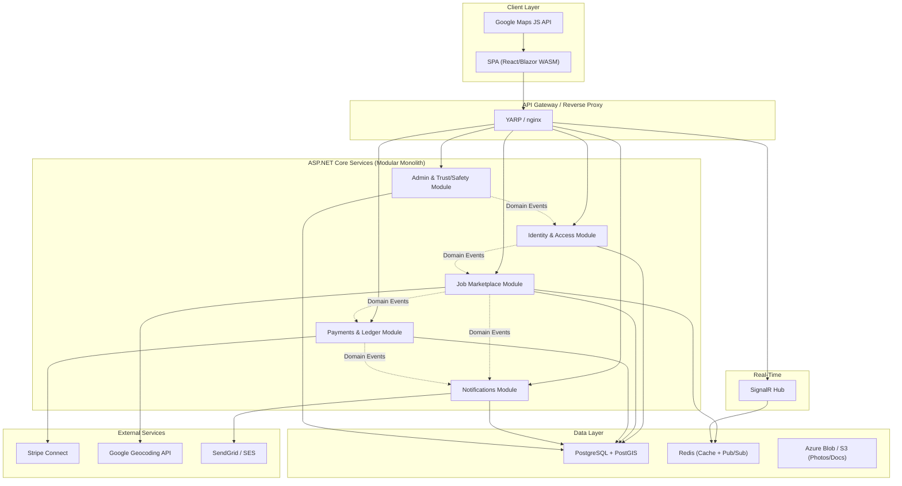
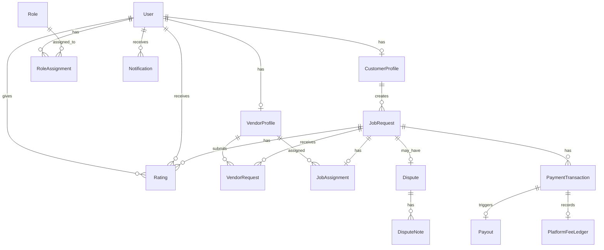
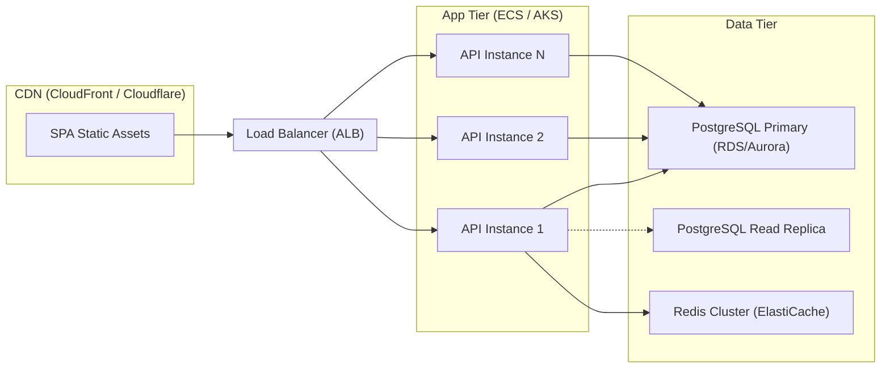

# Architecture Design: Rakr Platform

## 1. High-Level Architecture Diagram



---

## 2. Bounded Contexts

### 2.1 Identity & Access

**Responsibility:** User registration, authentication (JWT + refresh tokens), authorization (role-based + policy-based), OAuth providers, email verification, password management.

| Component | Technology |
|-----------|-----------|
| Auth Server | ASP.NET Core Identity + Duende IdentityServer (or simple JWT issuer) |
| Password Hashing | Argon2id |
| Token Storage | Redis (refresh token blocklist) |

### 2.2 Job Marketplace

**Responsibility:** Job request CRUD, geocoding, geospatial queries, vendor request workflow, job lifecycle state machine, map pin data API, category management.

| Component | Technology |
|-----------|-----------|
| Geospatial | PostGIS `geography(Point, 4326)` + GiST index |
| State Machine | Stateless library or custom FSM |
| Real-Time Pins | SignalR + Redis backplane |
| Geocoding | Google Geocoding API (with Mapbox fallback) |

### 2.3 Payments & Ledger

**Responsibility:** Payment intent creation, capture, platform fee calculation, vendor payouts, refunds, ledger entries, financial reporting.

| Component | Technology |
|-----------|-----------|
| Payment Gateway | Stripe Connect (destination charges) |
| Ledger | Double-entry append-only ledger table |
| Webhooks | Stripe webhook endpoint with idempotency |

### 2.4 Notifications

**Responsibility:** Event-driven notification dispatch (email, future push/SMS), template management, delivery tracking, user preferences.

| Component | Technology |
|-----------|-----------|
| Email | SendGrid / AWS SES |
| Queue | In-process channel or RabbitMQ |
| Templates | Razor/Scriban templates |

### 2.5 Admin & Trust/Safety

**Responsibility:** User moderation, vendor verification, dispute resolution, content flagging, audit logging, KPI dashboards, platform configuration.

| Component | Technology |
|-----------|-----------|
| Dashboard | Admin SPA or Blazor Server |
| Audit Log | Append-only `AuditEntry` table |
| Fraud Signals | Rule-based engine (post-MVP: ML) |

---

## 3. Event Flows

```mermaid
sequenceDiagram
    participant C as Customer
    participant JM as Job Marketplace
    participant N as Notifications
    participant V as Vendor (Map UI)
    participant SR as SignalR Hub
    participant P as Payments

    C->>JM: POST /api/jobs (create job)
    JM->>JM: Geocode address → lat/lng
    JM->>JM: Save JobRequest (status=Open)
    JM-->>SR: Publish "JobCreated" event
    SR-->>V: Push new pin to nearby vendors
    JM-->>N: Raise JobCreatedEvent
    N->>N: (No email for creation; vendors discover via map)

    V->>JM: POST /api/jobs/{id}/requests (Request Job)
    JM->>JM: Save VendorRequest
    JM-->>N: Raise VendorRequestedEvent
    N->>C: Email "A vendor wants your job"

    C->>JM: PUT /api/jobs/{id}/assign (accept vendor)
    JM->>JM: Status → Assigned
    JM-->>SR: Publish "JobAssigned" (remove pin)
    JM-->>N: Raise JobAssignedEvent
    N->>V: Email "You've been assigned"
    N->>C: Email "Vendor confirmed"

    V->>JM: PUT /api/jobs/{id}/complete
    JM->>JM: Status → Completed
    JM-->>N: Raise JobCompletedEvent
    N->>C: Email "Confirm completion & pay"

    C->>P: POST /api/payments/capture (confirm & pay)
    P->>P: Stripe charge, calculate fee, create ledger entries
    P-->>JM: Raise PaymentCapturedEvent
    JM->>JM: Status → Paid
    P-->>N: Raise PayoutInitiatedEvent
    N->>V: Email "Payment incoming"
```

---

## 4. Data Model (Normalized)

### 4.1 Entity-Relationship Diagram



### 4.2 Entity Definitions

#### User
```sql
CREATE TABLE "User" (
    id              UUID PRIMARY KEY DEFAULT gen_random_uuid(),
    email           VARCHAR(256) NOT NULL UNIQUE,
    email_verified  BOOLEAN NOT NULL DEFAULT FALSE,
    password_hash   TEXT,
    display_name    VARCHAR(100) NOT NULL,
    phone           VARCHAR(20),
    avatar_url      TEXT,
    auth_provider   VARCHAR(50),       -- 'local', 'google', 'apple'
    external_id     VARCHAR(256),      -- OAuth provider subject
    is_active       BOOLEAN NOT NULL DEFAULT TRUE,
    locked_until    TIMESTAMPTZ,
    created_at      TIMESTAMPTZ NOT NULL DEFAULT now(),
    updated_at      TIMESTAMPTZ NOT NULL DEFAULT now()
);
```

#### Role & RoleAssignment
```sql
CREATE TABLE "Role" (
    id    SMALLINT PRIMARY KEY,
    name  VARCHAR(50) NOT NULL UNIQUE  -- 'Customer', 'Vendor', 'Admin'
);

CREATE TABLE "RoleAssignment" (
    user_id     UUID NOT NULL REFERENCES "User"(id),
    role_id     SMALLINT NOT NULL REFERENCES "Role"(id),
    granted_at  TIMESTAMPTZ NOT NULL DEFAULT now(),
    PRIMARY KEY (user_id, role_id)
);
```

#### CustomerProfile
```sql
CREATE TABLE "CustomerProfile" (
    id                  UUID PRIMARY KEY DEFAULT gen_random_uuid(),
    user_id             UUID NOT NULL UNIQUE REFERENCES "User"(id),
    default_address     TEXT,
    default_location    geography(Point, 4326),
    stripe_customer_id  VARCHAR(100),
    created_at          TIMESTAMPTZ NOT NULL DEFAULT now(),
    updated_at          TIMESTAMPTZ NOT NULL DEFAULT now()
);
```

#### VendorProfile
```sql
CREATE TABLE "VendorProfile" (
    id                      UUID PRIMARY KEY DEFAULT gen_random_uuid(),
    user_id                 UUID NOT NULL UNIQUE REFERENCES "User"(id),
    business_name           VARCHAR(200),
    bio                     TEXT,
    service_categories      TEXT[] NOT NULL DEFAULT '{}',  -- e.g. {'mowing','hedging','snow'}
    service_radius_miles    SMALLINT NOT NULL DEFAULT 15,
    home_location           geography(Point, 4326),
    insurance_doc_url       TEXT,
    verification_status     VARCHAR(20) NOT NULL DEFAULT 'pending',  -- pending, approved, rejected
    stripe_account_id       VARCHAR(100),
    average_rating          NUMERIC(3,2) DEFAULT 0,
    total_jobs_completed    INT NOT NULL DEFAULT 0,
    created_at              TIMESTAMPTZ NOT NULL DEFAULT now(),
    updated_at              TIMESTAMPTZ NOT NULL DEFAULT now()
);
```

#### JobRequest
```sql
CREATE TABLE "JobRequest" (
    id                  UUID PRIMARY KEY DEFAULT gen_random_uuid(),
    customer_profile_id UUID NOT NULL REFERENCES "CustomerProfile"(id),
    title               VARCHAR(200) NOT NULL,
    description         TEXT NOT NULL,
    categories          TEXT[] NOT NULL,
    address             TEXT NOT NULL,
    location            geography(Point, 4326) NOT NULL,
    status              VARCHAR(20) NOT NULL DEFAULT 'open',
        -- open, requested, assigned, in_progress, completed, paid, closed, cancelled, disputed
    budget_cents        INT NOT NULL,
    schedule_start      TIMESTAMPTZ,
    schedule_end        TIMESTAMPTZ,
    photos              TEXT[],          -- URLs to blob storage
    expires_at          TIMESTAMPTZ,
    created_at          TIMESTAMPTZ NOT NULL DEFAULT now(),
    updated_at          TIMESTAMPTZ NOT NULL DEFAULT now()
);
```

#### VendorRequest
```sql
CREATE TABLE "VendorRequest" (
    id              UUID PRIMARY KEY DEFAULT gen_random_uuid(),
    job_request_id  UUID NOT NULL REFERENCES "JobRequest"(id),
    vendor_profile_id UUID NOT NULL REFERENCES "VendorProfile"(id),
    status          VARCHAR(20) NOT NULL DEFAULT 'pending',  -- pending, accepted, rejected, withdrawn
    proposed_price_cents INT,
    note            TEXT,
    created_at      TIMESTAMPTZ NOT NULL DEFAULT now(),
    updated_at      TIMESTAMPTZ NOT NULL DEFAULT now(),
    UNIQUE(job_request_id, vendor_profile_id)
);
```

#### JobAssignment
```sql
CREATE TABLE "JobAssignment" (
    id                  UUID PRIMARY KEY DEFAULT gen_random_uuid(),
    job_request_id      UUID NOT NULL UNIQUE REFERENCES "JobRequest"(id),
    vendor_profile_id   UUID NOT NULL REFERENCES "VendorProfile"(id),
    vendor_request_id   UUID NOT NULL REFERENCES "VendorRequest"(id),
    assigned_at         TIMESTAMPTZ NOT NULL DEFAULT now(),
    started_at          TIMESTAMPTZ,
    completed_at        TIMESTAMPTZ,
    confirmed_at        TIMESTAMPTZ  -- customer confirms completion
);
```

#### PaymentTransaction
```sql
CREATE TABLE "PaymentTransaction" (
    id                  UUID PRIMARY KEY DEFAULT gen_random_uuid(),
    job_request_id      UUID NOT NULL REFERENCES "JobRequest"(id),
    stripe_payment_intent_id VARCHAR(100),
    amount_cents        INT NOT NULL,
    platform_fee_cents  INT NOT NULL,
    vendor_payout_cents INT NOT NULL,
    currency            CHAR(3) NOT NULL DEFAULT 'usd',
    status              VARCHAR(20) NOT NULL DEFAULT 'pending',
        -- pending, captured, failed, refunded
    captured_at         TIMESTAMPTZ,
    created_at          TIMESTAMPTZ NOT NULL DEFAULT now()
);
```

#### Payout
```sql
CREATE TABLE "Payout" (
    id                      UUID PRIMARY KEY DEFAULT gen_random_uuid(),
    payment_transaction_id  UUID NOT NULL REFERENCES "PaymentTransaction"(id),
    vendor_profile_id       UUID NOT NULL REFERENCES "VendorProfile"(id),
    stripe_transfer_id      VARCHAR(100),
    amount_cents            INT NOT NULL,
    status                  VARCHAR(20) NOT NULL DEFAULT 'pending',
        -- pending, paid, failed
    paid_at                 TIMESTAMPTZ,
    created_at              TIMESTAMPTZ NOT NULL DEFAULT now()
);
```

#### PlatformFeeLedger
```sql
CREATE TABLE "PlatformFeeLedger" (
    id                      UUID PRIMARY KEY DEFAULT gen_random_uuid(),
    payment_transaction_id  UUID NOT NULL REFERENCES "PaymentTransaction"(id),
    entry_type              VARCHAR(20) NOT NULL,  -- 'fee_earned', 'refund_debit'
    amount_cents            INT NOT NULL,
    description             TEXT,
    created_at              TIMESTAMPTZ NOT NULL DEFAULT now()
);
```

#### Rating
```sql
CREATE TABLE "Rating" (
    id              UUID PRIMARY KEY DEFAULT gen_random_uuid(),
    job_request_id  UUID NOT NULL REFERENCES "JobRequest"(id),
    reviewer_id     UUID NOT NULL REFERENCES "User"(id),
    reviewee_id     UUID NOT NULL REFERENCES "User"(id),
    score           SMALLINT NOT NULL CHECK (score BETWEEN 1 AND 5),
    comment         TEXT,
    created_at      TIMESTAMPTZ NOT NULL DEFAULT now(),
    UNIQUE(job_request_id, reviewer_id)
);
```

#### Dispute
```sql
CREATE TABLE "Dispute" (
    id              UUID PRIMARY KEY DEFAULT gen_random_uuid(),
    job_request_id  UUID NOT NULL REFERENCES "JobRequest"(id),
    raised_by_id    UUID NOT NULL REFERENCES "User"(id),
    reason          TEXT NOT NULL,
    status          VARCHAR(20) NOT NULL DEFAULT 'open',  -- open, investigating, resolved
    resolution      TEXT,
    resolved_by_id  UUID REFERENCES "User"(id),
    resolved_at     TIMESTAMPTZ,
    created_at      TIMESTAMPTZ NOT NULL DEFAULT now()
);

CREATE TABLE "DisputeNote" (
    id          UUID PRIMARY KEY DEFAULT gen_random_uuid(),
    dispute_id  UUID NOT NULL REFERENCES "Dispute"(id),
    author_id   UUID NOT NULL REFERENCES "User"(id),
    body        TEXT NOT NULL,
    created_at  TIMESTAMPTZ NOT NULL DEFAULT now()
);
```

#### Notification
```sql
CREATE TABLE "Notification" (
    id          UUID PRIMARY KEY DEFAULT gen_random_uuid(),
    user_id     UUID NOT NULL REFERENCES "User"(id),
    type        VARCHAR(50) NOT NULL,  -- 'vendor_requested', 'job_assigned', 'payment_received', etc.
    title       VARCHAR(200) NOT NULL,
    body        TEXT,
    metadata    JSONB,                 -- flexible payload (job_id, etc.)
    is_read     BOOLEAN NOT NULL DEFAULT FALSE,
    channel     VARCHAR(20) NOT NULL DEFAULT 'email',  -- 'email', 'push', 'in_app'
    sent_at     TIMESTAMPTZ,
    created_at  TIMESTAMPTZ NOT NULL DEFAULT now()
);
```

#### AuditEntry (for Admin & Trust/Safety)
```sql
CREATE TABLE "AuditEntry" (
    id              BIGSERIAL PRIMARY KEY,
    actor_id        UUID REFERENCES "User"(id),
    action          VARCHAR(100) NOT NULL,   -- 'user.suspended', 'dispute.resolved', etc.
    entity_type     VARCHAR(50),
    entity_id       UUID,
    old_values      JSONB,
    new_values      JSONB,
    ip_address      INET,
    created_at      TIMESTAMPTZ NOT NULL DEFAULT now()
);
```

---

## 5. Database Indexes

### 5.1 Core Query Indexes

```sql
-- Job discovery: status + creation order
CREATE INDEX idx_jobrequest_status_created
    ON "JobRequest" (status, created_at DESC)
    WHERE status = 'open';

-- Geospatial index for map pin queries (PostGIS GiST)
CREATE INDEX idx_jobrequest_location_gist
    ON "JobRequest" USING GIST (location);

-- Combined: open jobs near a point (used by map query)
-- Query pattern: WHERE status = 'open' AND ST_DWithin(location, :point, :radius_meters)
-- The partial index + GiST index together serve this efficiently.

-- Vendor home location for radius matching
CREATE INDEX idx_vendorprofile_location_gist
    ON "VendorProfile" USING GIST (home_location);

-- Vendor requests per job
CREATE INDEX idx_vendorrequest_job
    ON "VendorRequest" (job_request_id, status);

-- Vendor requests per vendor
CREATE INDEX idx_vendorrequest_vendor
    ON "VendorRequest" (vendor_profile_id, created_at DESC);

-- Customer's jobs
CREATE INDEX idx_jobrequest_customer
    ON "JobRequest" (customer_profile_id, created_at DESC);

-- Notifications (unread, per user)
CREATE INDEX idx_notification_user_unread
    ON "Notification" (user_id, created_at DESC)
    WHERE is_read = FALSE;

-- Payments by job
CREATE INDEX idx_payment_job
    ON "PaymentTransaction" (job_request_id);

-- Ratings per reviewee (for avg calculation)
CREATE INDEX idx_rating_reviewee
    ON "Rating" (reviewee_id);

-- Audit log time-series
CREATE INDEX idx_audit_created
    ON "AuditEntry" (created_at DESC);

-- Dispute queue (open disputes)
CREATE INDEX idx_dispute_status
    ON "Dispute" (status, created_at)
    WHERE status IN ('open', 'investigating');
```

### 5.2 Geospatial Query Pattern

The primary map query used by the vendor's Map Discovery view:

```sql
SELECT
    jr.id, jr.title, jr.categories, jr.budget_cents,
    jr.schedule_start, jr.schedule_end,
    ST_Distance(jr.location, ST_SetSRID(ST_MakePoint(:lng, :lat), 4326)::geography) AS distance_meters
FROM "JobRequest" jr
WHERE jr.status = 'open'
  AND ST_DWithin(
        jr.location,
        ST_SetSRID(ST_MakePoint(:lng, :lat), 4326)::geography,
        :radius_meters
      )
ORDER BY distance_meters
LIMIT 200;
```

**Performance notes:**
- `ST_DWithin` on `geography` type uses the GiST index for a bounding-box prescan, then exact geodesic check.
- Partial index on `status = 'open'` keeps the index compact (only active jobs).
- At 10k open jobs in a metro area, this query returns in < 50 ms on a 4-core / 16 GB PostgreSQL instance with warm cache.

---

## 6. Data Retention & Audit Design

### 6.1 Retention Policy

| Data Category | Retention | Rationale |
|---------------|-----------|-----------|
| Active user data | Indefinite (until deletion request) | Operational |
| Completed job records | 7 years | Tax/legal compliance |
| Payment transactions & ledger | 7 years | Financial regulations |
| Audit entries | 5 years | Compliance & forensics |
| Notifications | 90 days (soft-delete) | UX; not business-critical |
| Deleted user PII | 30-day grace period, then hard-purge | GDPR right-to-delete |
| Dispute records | 7 years | Legal |
| Session / refresh tokens | 30 days max TTL | Security |

### 6.2 Audit Design

1. **Append-only `AuditEntry` table** — never updated or deleted.
2. **Captured on:** All admin actions, status transitions, user suspensions, payment events, profile changes, dispute resolutions.
3. **Stored fields:** Actor, action name, target entity type + ID, before/after JSON snapshots, IP address, timestamp.
4. **Access:** Read-only for admins via dashboard; export via CSV for compliance.
5. **Partitioning:** Range-partition by `created_at` (monthly) for efficient archival and querying.
6. **Immutability enforced:** Database trigger prevents UPDATE/DELETE on `AuditEntry`.

### 6.3 Soft-Delete Strategy

All user-facing entities use soft-delete (`is_deleted BOOLEAN DEFAULT FALSE`, `deleted_at TIMESTAMPTZ`) rather than hard delete. Hard purge runs as a scheduled background job after the grace period.

---

## 7. Deployment Architecture (Production)



**Key decisions:**
- Modular monolith at MVP (single deployable, logical module separation) — decompose to microservices only if scale demands it.
- PostgreSQL with PostGIS extension for geospatial.
- Redis for SignalR backplane, caching (job pin data), and rate limiting.
- Horizontal scaling via container orchestration (ECS Fargate or AKS).
- Read replicas serve map queries under heavy load.
- Secrets managed via AWS Secrets Manager / Azure Key Vault.

---

## 8. Security Architecture

| Layer | Control |
|-------|---------|
| Transport | TLS 1.3 everywhere; HSTS headers |
| Authentication | JWT (short-lived, 15 min) + HttpOnly secure refresh cookie |
| Authorization | Policy-based (ASP.NET `IAuthorizationHandler`); resource ownership checks |
| API Protection | Rate limiting (sliding window per user), request size limits, input validation (FluentValidation) |
| Payment | No card data stored; Stripe.js + Connect handles PCI scope |
| Data at Rest | PostgreSQL TDE; encrypted blob storage |
| Secrets | Vault-managed; never in config files or env vars in plain text |
| CSRF | Anti-forgery tokens for cookie-auth'd endpoints |
| Logging | PII scrubbed from logs; structured JSON via Serilog |

---

## 9. Module Communication (Internal Events)

Within the modular monolith, modules communicate via an in-process event bus (MediatR `INotification`):

| Event | Publisher | Subscribers |
|-------|-----------|-------------|
| `JobCreatedEvent` | Job Marketplace | Notifications, SignalR Hub |
| `VendorRequestedEvent` | Job Marketplace | Notifications |
| `JobAssignedEvent` | Job Marketplace | Notifications, SignalR Hub |
| `JobCompletedEvent` | Job Marketplace | Notifications, Payments |
| `PaymentCapturedEvent` | Payments | Job Marketplace, Notifications |
| `PayoutFailedEvent` | Payments | Notifications, Admin |
| `UserSuspendedEvent` | Admin | Identity & Access |
| `DisputeRaisedEvent` | Admin | Notifications |
| `VendorVerifiedEvent` | Admin | Notifications, Job Marketplace |

If/when services split, these become messages on RabbitMQ / AWS SNS+SQS with guaranteed delivery.
