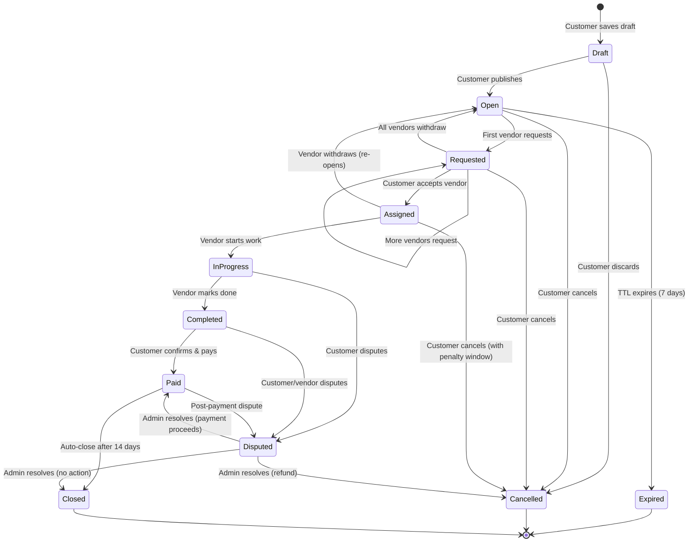
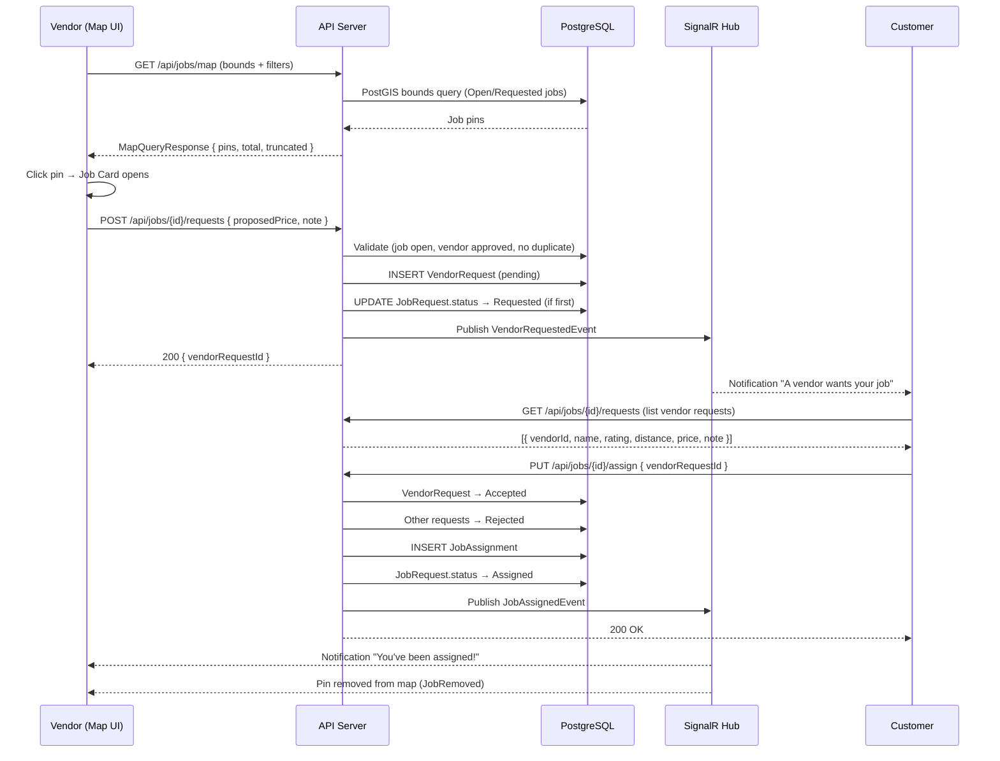
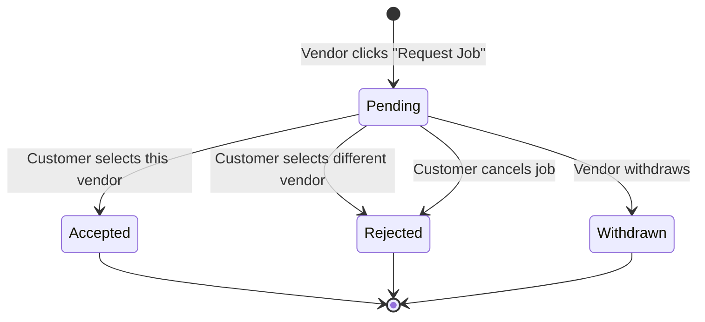
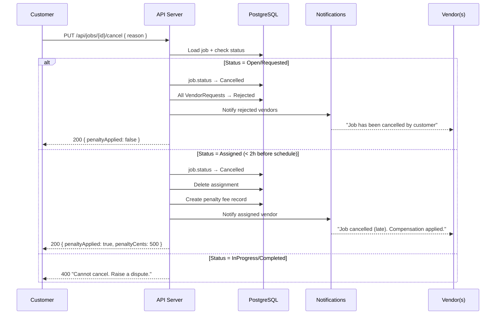
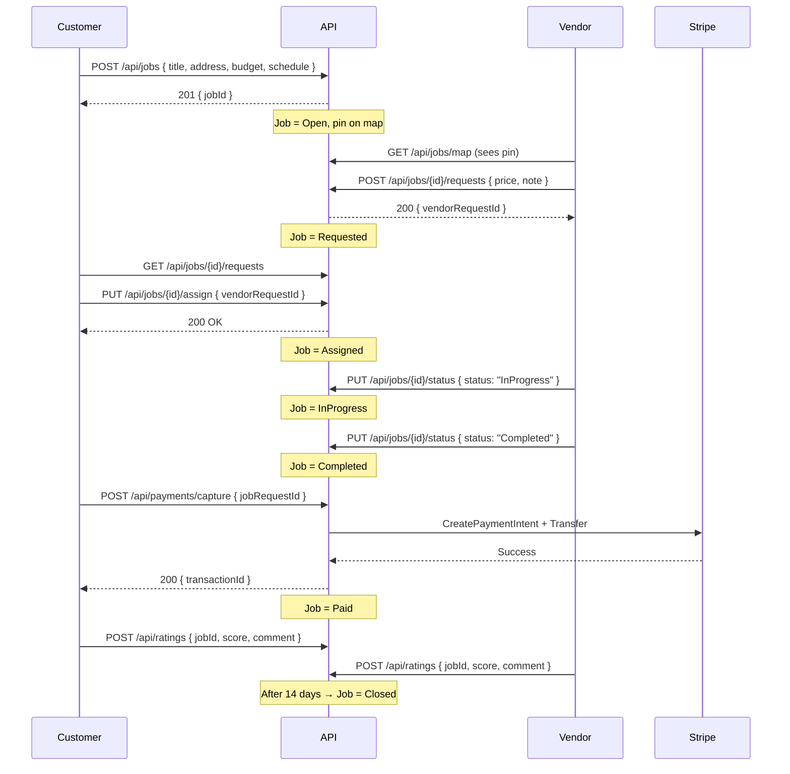
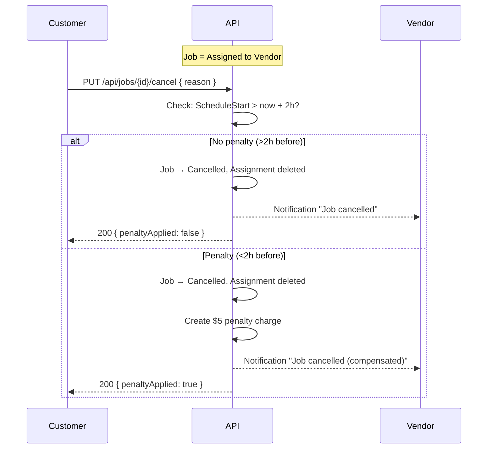
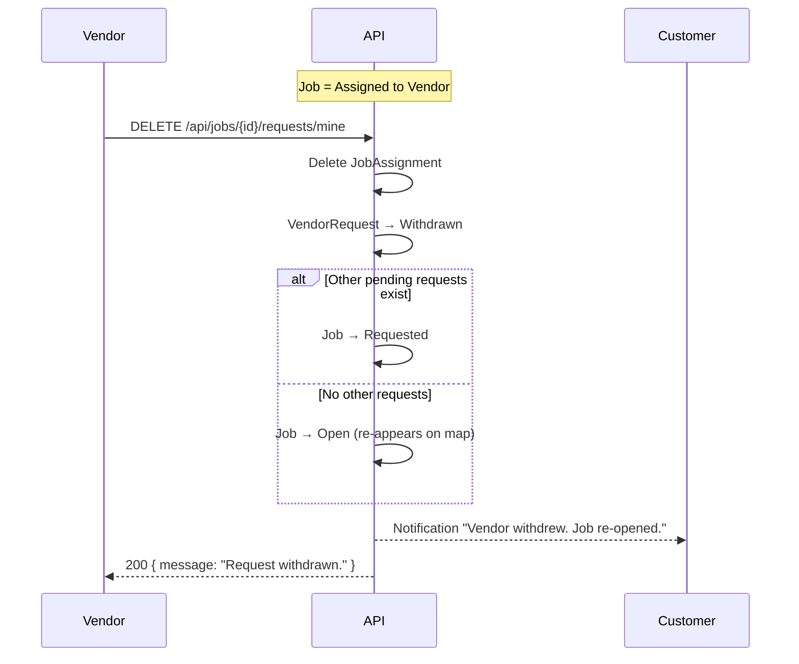

# Core Job Marketplace Workflows — Functional Specification

## 1. User Stories

### Customer Stories

| ID | Story | Acceptance Criteria |
|----|-------|-------------------|
| CS-1 | As a customer, I want to post a job with location, budget, and schedule so vendors can find it on the map. | Job appears as pin within 2s of creation; geocoding succeeds; all fields persisted. |
| CS-2 | As a customer, I want to review vendor requests with their profile, rating, and note so I can choose the best fit. | Request list shows vendor name, rating, distance, proposed price, note. |
| CS-3 | As a customer, I want to accept one vendor and auto-reject others so assignment is clear. | Accepted vendor notified; all others receive rejection notification; job status → Assigned. |
| CS-4 | As a customer, I want to cancel a job before assignment so I'm not locked in. | Job moves to Cancelled; all pending vendor requests are rejected with notification. |
| CS-5 | As a customer, I want to reschedule a job's time window before work starts. | Schedule updated; assigned vendor notified; vendor can accept or withdraw. |
| CS-6 | As a customer, I want to confirm completion and trigger payment. | Job → Paid; vendor payout initiated; both parties can leave ratings. |

### Vendor Stories

| ID | Story | Acceptance Criteria |
|----|-------|-------------------|
| VS-1 | As a vendor, I want to browse jobs on a map and request ones I can do. | Map pins show; clicking opens card; "Request Job" creates VendorRequest. |
| VS-2 | As a vendor, I want to propose a price different from the customer's budget. | ProposedPriceCents stored; visible to customer in request review. |
| VS-3 | As a vendor, I want to withdraw my request if I change my mind. | VendorRequest → Withdrawn; job unblocked for other vendors. |
| VS-4 | As a vendor, I want to mark a job as in-progress when I start work. | Job → InProgress; customer notified; timestamp recorded. |
| VS-5 | As a vendor, I want to mark a job as completed when finished. | Job → Completed; customer prompted to confirm & pay. |
| VS-6 | As a vendor, I want to be notified if a customer cancels after assignment. | Notification sent; vendor freed for other jobs. |

---

## 2. Job Lifecycle State Machine

### 2.1 State Diagram (Mermaid)



### 2.2 State Transition Table

| From | To | Actor | Trigger | Side Effects |
|------|----|-------|---------|--------------|
| Draft | Open | Customer | Publish job | Geocode address; pin appears on map; SignalR broadcast |
| Draft | Cancelled | Customer | Discard draft | Soft-delete |
| Open | Requested | System | First VendorRequest created | Customer notified |
| Open | Cancelled | Customer | Cancel job | All pending requests rejected; pin removed |
| Open | Expired | System | 7-day TTL | Auto-transition via background job; pin removed |
| Requested | Assigned | Customer | Accept a vendor | VendorRequest → Accepted; others → Rejected; assignment created; pin removed |
| Requested | Open | System | All vendors withdraw | Status reverts; pin remains |
| Requested | Cancelled | Customer | Cancel job | All requests rejected; pin removed |
| Assigned | InProgress | Vendor | Start work | Assignment.StartedAt set; customer notified |
| Assigned | Cancelled | Customer | Cancel before work starts | Assignment deleted; vendor notified; late-cancel fee possible |
| Assigned | Open | Vendor | Vendor withdraws after accept | Assignment deleted; job re-opens |
| InProgress | Completed | Vendor | Mark complete | Assignment.CompletedAt set; customer prompted to pay |
| InProgress | Disputed | Customer | Raise dispute | Dispute record created; admin notified |
| Completed | Paid | Customer | Confirm & pay | Payment captured; payout initiated |
| Completed | Disputed | Either | Raise dispute | Payment held pending resolution |
| Paid | Closed | System | 14-day auto-close | Rating window closes |
| Paid | Disputed | Either | Raise dispute | Payout may be clawed back |
| Disputed | Paid/Cancelled/Closed | Admin | Resolve | Based on resolution type |

### 2.3 Terminal States

- **Cancelled** — Job was abandoned or resolved with refund.
- **Expired** — Job TTL elapsed with no assignment.
- **Closed** — Successfully completed, paid, and finalized.

---

## 3. Vendor Request Flow (Map Pin → Assignment)

### 3.1 Sequence Diagram



### 3.2 Vendor Request Lifecycle



---

## 4. Conflict Handling for Concurrent Requests

### 4.1 Race Condition: Multiple Vendors Request Same Job

**Scenario:** Vendors A and B both see an Open job pin and click "Request Job" near-simultaneously.

**Resolution:** Both succeed. The job transitions to `Requested` on the first request. Subsequent requests are additive — the job accumulates multiple `VendorRequest` records with `Pending` status.

**Implementation:**
- Unique constraint on `(job_request_id, vendor_profile_id)` prevents the same vendor from requesting twice.
- No optimistic concurrency on the job status change (`Open → Requested`) because it's idempotent — second request sees status is already `Requested` and skips the update.

### 4.2 Race Condition: Assign While Another Request Arrives

**Scenario:** Customer accepts Vendor A at the same moment Vendor B submits a request.

**Resolution (optimistic locking):**
1. `AssignVendorHandler` loads the job with a concurrency token (`UpdatedAt` / `xmin`).
2. If job status is `Open` or `Requested`, proceed with assignment.
3. Any new requests for an `Assigned` job are rejected: "Job is no longer open for requests."
4. The `RequestJobHandler` checks `job.Status != JobStatus.Open` (and now also checks `!= Requested` is fine since requests are additive).

**Actual race window:** Because both operations write to `JobRequest.Status`, PostgreSQL's row-level locking ensures one wins and the other retries or sees updated state.

### 4.3 Race Condition: Customer Cancels While Vendor Requests

**Scenario:** Customer cancels an Open job while a vendor is submitting a request.

**Resolution:**
- Cancellation sets status to `Cancelled`.
- Vendor's request handler reads current status → sees `Cancelled` → returns "Job is no longer open."
- If the request was already persisted before cancellation, the cancellation handler bulk-rejects all pending requests.

### 4.4 Concurrency Token Strategy

```csharp
// In EF configuration:
builder.Property(j => j.UpdatedAt).IsConcurrencyToken();

// Handlers catch DbUpdateConcurrencyException and retry or return conflict error.
```

---

## 5. Cancellation & Reschedule Flows

### 5.1 Customer Cancels Job

| Current Status | Cancellation Rules | Side Effects |
|---------------|-------------------|--------------|
| Draft | Always allowed | Soft-delete |
| Open | Always allowed | Pin removed from map |
| Requested | Always allowed | All pending VendorRequests → Rejected; vendors notified |
| Assigned | Allowed with conditions | Vendor notified; assignment deleted; late-cancel penalty if < 2h before schedule |
| InProgress | NOT allowed | Must raise dispute instead |
| Completed | NOT allowed | Must raise dispute instead |

**Late Cancellation Penalty:**
If the job is `Assigned` and `ScheduleStart` is within 2 hours, cancellation incurs a platform fee (e.g., $5) to compensate the vendor for lost time.

**API:** `PUT /api/jobs/{id}/cancel`

```json
// Request (optional reason)
{ "reason": "Change of plans" }

// Response: 200
{ "message": "Job cancelled.", "penaltyApplied": false }

// Error: 400
{ "errors": ["Cannot cancel a job that is in progress. Please raise a dispute."] }
```

### 5.2 Vendor Withdraws Request

**Scenario:** Vendor changes mind before customer assigns.

| VendorRequest Status | Withdraw Allowed |
|---------------------|------------------|
| Pending | ✅ Yes |
| Accepted (Assigned) | ✅ Yes — triggers job re-open |
| Rejected | ❌ No (already final) |
| Withdrawn | ❌ No (already final) |

**If vendor withdraws after being assigned:**
- JobAssignment is deleted.
- Job status reverts to `Open` (or `Requested` if other pending requests exist).
- Customer is notified: "Your assigned vendor has withdrawn."

**API:** `DELETE /api/jobs/{jobId}/requests/mine`

```json
// Response: 200
{ "message": "Request withdrawn." }
```

### 5.3 Customer Reschedules Job

**Scenario:** Customer wants to change the schedule window after posting.

**Rules:**
- Allowed in: `Open`, `Requested`, `Assigned`
- NOT allowed in: `InProgress`, `Completed`, `Paid`, `Closed`
- If `Assigned`, the vendor must acknowledge the new schedule (or can withdraw).

**API:** `PUT /api/jobs/{id}/reschedule`

```json
// Request
{
  "scheduleStart": "2026-07-05T09:00:00Z",
  "scheduleEnd": "2026-07-05T17:00:00Z"
}

// Response: 200
{ "message": "Schedule updated.", "vendorNotified": true }
```

**Flow when Assigned:**
1. Customer submits new schedule.
2. Job updated; vendor notified.
3. Vendor has 24h to accept (no action = accept) or withdraw.
4. If vendor withdraws → job re-opens.

### 5.4 Sequence Diagram: Cancellation



---

## 6. Domain Validation Rules

### 6.1 Job Creation Validation

| Field | Rule | Error Message |
|-------|------|---------------|
| Title | Required, 1-200 chars | "Title is required and must be under 200 characters." |
| Description | Required, 1-5000 chars | "Description is required." |
| Categories | At least 1, max 5 | "At least one category is required. Maximum 5." |
| Address | Required, must geocode successfully | "We couldn't locate this address. Please refine it." |
| BudgetCents | > 0, max 1,000,000 ($10,000) | "Budget must be between $1 and $10,000." |
| ScheduleStart | Must be in the future (> now + 1h) | "Schedule must be at least 1 hour from now." |
| ScheduleEnd | Must be after ScheduleStart | "End time must be after start time." |
| Schedule window | Max 7 days | "Schedule window cannot exceed 7 days." |
| Photos | Max 10, each URL < 500 chars | "Maximum 10 photos allowed." |

### 6.2 Vendor Request Validation

| Rule | Error Message |
|------|---------------|
| Vendor must have VerificationStatus = Approved | "Vendor must be verified to request jobs." |
| Job must be Open or Requested | "Job is no longer open for requests." |
| No duplicate (unique per vendor per job) | "You have already requested this job." |
| ProposedPriceCents if provided: > 0, < job budget × 3 | "Proposed price must be reasonable." |
| Note if provided: max 500 chars | "Note must be under 500 characters." |
| Vendor cannot request own job | "You cannot request your own job." |

### 6.3 Assignment Validation

| Rule | Error Message |
|------|---------------|
| Only job owner (customer) can assign | "Only the job owner can assign vendors." |
| Job must be in Open/Requested status | "Job is not in a state that allows assignment." |
| VendorRequest must exist for this job | "Vendor request not found." |
| VendorRequest must be Pending | "This vendor request is no longer pending." |

### 6.4 Status Transition Validation

| Rule | Error Message |
|------|---------------|
| Only assigned vendor can mark InProgress | "Only the assigned vendor can start this job." |
| Only assigned vendor can mark Completed | "Only the assigned vendor can complete this job." |
| Only customer can confirm payment | "Only the customer can confirm payment." |
| Cannot skip states | "Cannot transition from {current} to {target}." |

### 6.5 Cancellation Validation

| Rule | Error Message |
|------|---------------|
| Cannot cancel InProgress/Completed/Paid/Closed | "Cannot cancel a job that is in progress. Please raise a dispute." |
| Only job owner can cancel | "Only the job owner can cancel." |
| Late cancel (< 2h before schedule, Assigned) | Warning + penalty applied |

---

## 7. Endpoint Contracts Summary

### 7.1 Job CRUD

| Method | Endpoint | Actor | Description |
|--------|----------|-------|-------------|
| POST | `/api/jobs` | Customer | Create and publish a job |
| GET | `/api/jobs/{id}` | Any auth | Get job details |
| GET | `/api/jobs/map` | Vendor | Bounds-based map query |
| GET | `/api/jobs/nearby` | Vendor | Radius-based query (legacy) |
| PUT | `/api/jobs/{id}/status` | Vendor/Customer | Transition job status |
| PUT | `/api/jobs/{id}/cancel` | Customer | Cancel a job |
| PUT | `/api/jobs/{id}/reschedule` | Customer | Update schedule window |

### 7.2 Vendor Requests

| Method | Endpoint | Actor | Description |
|--------|----------|-------|-------------|
| POST | `/api/jobs/{id}/requests` | Vendor | Request a job from map |
| GET | `/api/jobs/{id}/requests` | Customer | List vendor requests for a job |
| DELETE | `/api/jobs/{id}/requests/mine` | Vendor | Withdraw own request |

### 7.3 Assignment

| Method | Endpoint | Actor | Description |
|--------|----------|-------|-------------|
| PUT | `/api/jobs/{id}/assign` | Customer | Accept a vendor request |

---

## 8. Auto-Assignment Rules (Future / Configurable)

At MVP, assignment is **always manual** (customer reviews and selects). However, the system supports future auto-assignment:

### 8.1 Auto-Accept Rule (Customer Opt-In)

If the customer enables "Auto-accept first vendor" on a job:
1. First `VendorRequest` that arrives triggers automatic assignment.
2. System acts as if customer called `PUT /api/jobs/{id}/assign`.
3. All subsequent requests are auto-rejected.

### 8.2 Preferred Vendor Rule

If the customer has a saved list of preferred vendors:
1. When a preferred vendor requests, auto-accept if enabled.
2. Non-preferred vendors queue normally.

### 8.3 Rating Threshold Rule

Customer can set: "Auto-accept any vendor with rating ≥ 4.5":
1. System checks incoming vendor's average rating.
2. If ≥ threshold → auto-assign.
3. Otherwise → queue for manual review.

**Implementation:** These rules live in a `JobAutoAssignmentConfig` entity linked to JobRequest, evaluated in an event handler on `VendorRequestedEvent`.

---

## 9. Background Jobs

| Job | Schedule | Action |
|-----|----------|--------|
| Expire stale Open/Requested jobs | Every 1 hour | `Open/Requested` jobs past `ExpiresAt` → `Expired` |
| Auto-close Paid jobs | Daily | `Paid` jobs older than 14 days → `Closed` |
| Nudge unresponsive customers | After 48h | `Requested` jobs with no action → email reminder |
| Payout retry | Every 15 min | Retry failed payouts (max 3 attempts) |

---

## 10. Key Sequence Diagrams

### 10.1 Full Happy Path: Post → Request → Assign → Complete → Pay



### 10.2 Cancellation After Assignment



### 10.3 Vendor Withdraws After Assignment



---

## 11. Error Scenarios & Recovery

| Scenario | Detection | Recovery |
|----------|-----------|----------|
| Payment capture fails | Stripe webhook `payment_intent.payment_failed` | Job stays `Completed`; customer notified to update payment; retry in 24h |
| Vendor no-show (assigned but never starts) | Background job: Assigned > 24h past ScheduleEnd | Auto-cancel; customer notified; vendor's reliability score reduced |
| Customer never confirms completion | Background job: Completed > 72h | Auto-confirm and capture payment |
| Double-spend (concurrent payment attempts) | Idempotency key on PaymentTransaction per job | Only first capture succeeds; subsequent return existing transaction |
| Geocoding failure on job creation | Google API returns no results | Job creation blocked with user-friendly error |
| Vendor requests expired job (race condition) | Status check in handler | Return "Job has expired" |
