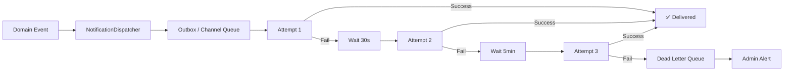
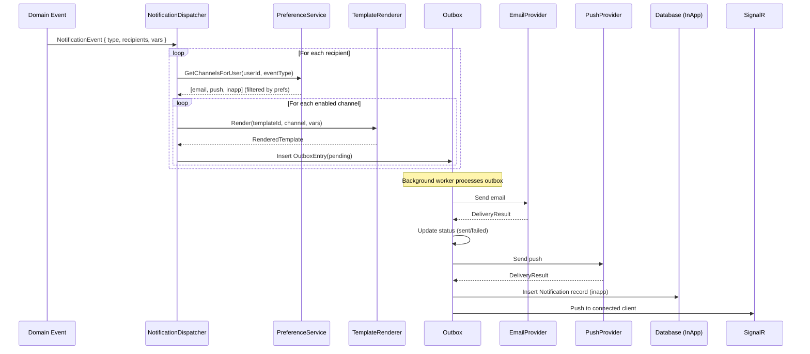

# Notifications, Messaging & Scheduling — Technical Specification

## 1. Notification Event Catalog

### 1.1 Job Lifecycle Events

| Event ID | Event Name | Trigger | Recipients | Channels |
|----------|-----------|---------|------------|----------|
| `N01` | `job.created` | Customer publishes job | Nearby vendors (SignalR only) | InApp, Push |
| `N02` | `vendor.requested` | Vendor clicks "Request Job" | Customer | Email, InApp, Push |
| `N03` | `vendor.request_rejected` | Customer accepts another vendor | Rejected vendors | InApp, Push |
| `N04` | `job.assigned` | Customer accepts a vendor | Assigned vendor | Email, InApp, Push |
| `N05` | `job.started` | Vendor marks InProgress | Customer | InApp, Push |
| `N06` | `job.completed` | Vendor marks Completed | Customer | Email, InApp, Push |
| `N07` | `job.confirmed_paid` | Customer confirms & pays | Vendor | Email, InApp, Push |
| `N08` | `job.cancelled` | Customer cancels job | All pending/assigned vendors | Email, InApp |
| `N09` | `job.rescheduled` | Customer changes schedule | Assigned vendor | Email, InApp, Push |
| `N10` | `vendor.withdrew` | Vendor withdraws request/assignment | Customer | Email, InApp |
| `N11` | `job.expired` | Job TTL elapsed | Customer | Email, InApp |

### 1.2 Payment Events

| Event ID | Event Name | Trigger | Recipients | Channels |
|----------|-----------|---------|------------|----------|
| `N20` | `payment.captured` | Payment successfully charged | Customer, Vendor | Email, InApp |
| `N21` | `payment.failed` | Payment charge failed | Customer | Email, InApp, Push |
| `N22` | `payout.initiated` | Transfer sent to vendor | Vendor | InApp |
| `N23` | `payout.completed` | Vendor receives funds | Vendor | Email, InApp |
| `N24` | `payout.failed` | Transfer to vendor failed | Vendor, Admin | Email, InApp |
| `N25` | `refund.issued` | Refund processed | Customer, Vendor | Email, InApp |

### 1.3 Account Events

| Event ID | Event Name | Trigger | Recipients | Channels |
|----------|-----------|---------|------------|----------|
| `N30` | `account.welcome` | User registers | New user | Email |
| `N31` | `account.email_verified` | Email confirmed | User | InApp |
| `N32` | `account.vendor_approved` | Admin approves vendor | Vendor | Email, InApp, Push |
| `N33` | `account.vendor_rejected` | Admin rejects vendor | Vendor | Email, InApp |
| `N34` | `account.suspended` | Admin suspends account | User | Email |
| `N35` | `account.password_reset` | User requests reset | User | Email |

### 1.4 Engagement Events

| Event ID | Event Name | Trigger | Recipients | Channels |
|----------|-----------|---------|------------|----------|
| `N40` | `rating.received` | Counterparty rates user | User | InApp, Push |
| `N41` | `dispute.opened` | Dispute raised | Counterparty, Admin | Email, InApp |
| `N42` | `dispute.resolved` | Admin resolves dispute | Both parties | Email, InApp |
| `N43` | `nudge.unresponsive` | 48h no action on requests | Customer | Email, Push |
| `N44` | `nudge.complete_profile` | Vendor profile incomplete | Vendor | Email |

---

## 2. Template Strategy

### 2.1 Template Architecture

```
Templates/
├── Email/
│   ├── _layout.html              ← Base layout (header, footer, branding)
│   ├── vendor_requested.html     ← Per-event content block
│   ├── job_assigned.html
│   ├── payment_captured.html
│   └── ...
├── Push/
│   ├── vendor_requested.json     ← { title, body, data }
│   └── ...
└── InApp/
    └── (stored in DB, rendered client-side)
```

### 2.2 Email Template Example: `vendor_requested`

```html
<!-- Subject: "A vendor wants your job: {{jobTitle}}" -->
<p>Hi {{customerName}},</p>

<p><strong>{{vendorName}}</strong> wants to work on your job 
   <strong>"{{jobTitle}}"</strong>.</p>

<div class="card">
  <p>⭐ Rating: {{vendorRating}}/5 ({{vendorJobCount}} jobs completed)</p>
  <p>💰 Proposed: {{proposedPrice | currency}}</p>
  <p>📝 "{{vendorNote | truncate:100}}"</p>
</div>

<a href="{{appUrl}}/jobs/{{jobId}}/requests" class="btn">Review Request</a>

<p>You have {{pendingRequestCount}} pending requests for this job.</p>
```

### 2.3 Template Variables (per event)

| Variable | Source | Available In |
|----------|--------|-------------|
| `{{customerName}}` | User.DisplayName | All customer-directed |
| `{{vendorName}}` | VendorProfile.BusinessName ?? User.DisplayName | All vendor-related |
| `{{jobTitle}}` | JobRequest.Title | All job events |
| `{{jobId}}` | JobRequest.Id | All job events |
| `{{budgetFormatted}}` | `$X.XX` format of BudgetCents | Job events |
| `{{vendorRating}}` | VendorProfile.AverageRating | Vendor-related |
| `{{proposedPrice}}` | VendorRequest.ProposedPriceCents formatted | Request events |
| `{{vendorNote}}` | VendorRequest.Note | Request events |
| `{{scheduleWindow}}` | Formatted date range | Schedule events |
| `{{appUrl}}` | Configuration: App base URL | All |
| `{{payoutAmount}}` | Payout.AmountCents formatted | Payment events |
| `{{refundAmount}}` | Refund amount formatted | Refund events |

### 2.4 Push Notification Templates

```json
// N02: vendor.requested
{
  "title": "New request for '{{jobTitle}}'",
  "body": "{{vendorName}} wants to do your job. Tap to review.",
  "icon": "/icons/request.png",
  "data": { "type": "vendor_requested", "jobId": "{{jobId}}" },
  "click_action": "/jobs/{{jobId}}/requests"
}

// N04: job.assigned
{
  "title": "You got the job! 🎉",
  "body": "You've been assigned to '{{jobTitle}}'. Check details.",
  "icon": "/icons/assigned.png",
  "data": { "type": "job_assigned", "jobId": "{{jobId}}" },
  "click_action": "/vendor/jobs/{{jobId}}"
}

// N07: job.confirmed_paid
{
  "title": "Payment received: {{payoutAmount}}",
  "body": "Payment for '{{jobTitle}}' is on its way to your account.",
  "icon": "/icons/payment.png",
  "data": { "type": "payment_received", "jobId": "{{jobId}}" }
}
```

### 2.5 InApp Notification Model

```json
{
  "id": "uuid",
  "type": "vendor_requested",
  "title": "New request for 'Front Yard Mowing'",
  "body": "John's Landscaping wants to do your job.",
  "metadata": { "jobId": "...", "vendorProfileId": "..." },
  "isRead": false,
  "createdAt": "2026-06-24T14:30:00Z"
}
```

---

## 3. Provider Abstraction Interfaces

### 3.1 Interface Design

```csharp
/// <summary>
/// Core orchestrator — resolves channels, applies preferences, dispatches.
/// </summary>
public interface INotificationDispatcher
{
    Task DispatchAsync(NotificationEvent evt, CancellationToken ct = default);
}

/// <summary>
/// Email delivery provider (SendGrid, SES, SMTP).
/// </summary>
public interface IEmailProvider
{
    Task<DeliveryResult> SendAsync(EmailMessage message, CancellationToken ct = default);
}

/// <summary>
/// Push notification provider (Firebase Cloud Messaging).
/// </summary>
public interface IPushProvider
{
    Task<DeliveryResult> SendAsync(PushMessage message, CancellationToken ct = default);
}

/// <summary>
/// SMS delivery provider (Twilio, SNS).
/// </summary>
public interface ISmsProvider
{
    Task<DeliveryResult> SendAsync(SmsMessage message, CancellationToken ct = default);
}

/// <summary>
/// Template rendering engine.
/// </summary>
public interface ITemplateRenderer
{
    Task<RenderedTemplate> RenderAsync(string templateId, string channel, Dictionary<string, object> variables, CancellationToken ct = default);
}
```

### 3.2 Message Models

```csharp
public record NotificationEvent(
    string EventType,            // "vendor.requested"
    Guid[] RecipientUserIds,
    Dictionary<string, object> Variables,
    NotificationPriority Priority = NotificationPriority.Normal
);

public record EmailMessage(
    string ToEmail,
    string ToName,
    string Subject,
    string HtmlBody,
    string? PlainTextBody = null,
    string? ReplyTo = null
);

public record PushMessage(
    string[] DeviceTokens,
    string Title,
    string Body,
    Dictionary<string, string>? Data = null,
    string? ImageUrl = null
);

public record SmsMessage(string PhoneNumber, string Body);

public record DeliveryResult(
    bool Succeeded,
    string? ProviderId,     // External message ID for tracking
    string? ErrorMessage
);

public record RenderedTemplate(string Subject, string HtmlBody, string? PlainTextBody);

public enum NotificationPriority { Low, Normal, High, Critical }
```

### 3.3 Provider Implementations (Pluggable)

| Channel | MVP Provider | Production Provider |
|---------|-------------|-------------------|
| Email | Log to console | SendGrid API |
| Push | Not implemented | Firebase Cloud Messaging (FCM) |
| SMS | Not implemented | Twilio |
| InApp | Database + SignalR | Same |

---

## 4. Retry & Dead-Letter Handling

### 4.1 Delivery Pipeline



### 4.2 Retry Policy

| Attempt | Delay | Channel | Notes |
|---------|-------|---------|-------|
| 1 | Immediate | All | First try |
| 2 | 30 seconds | Email, Push | Transient failures |
| 3 | 5 minutes | Email, Push | Provider outage |
| 4 | 30 minutes | Email only | Extended outage |
| Dead Letter | — | — | After max retries; admin review |

**Channel-specific max retries:**
- Email: 4 attempts (important, must deliver)
- Push: 3 attempts (best-effort, device may be offline)
- SMS: 3 attempts (carrier issues)
- InApp: 1 attempt (no retry — DB write or fail)

### 4.3 Outbox Pattern

```csharp
public class NotificationOutboxEntry
{
    public Guid Id { get; set; }
    public string EventType { get; set; }
    public Guid RecipientUserId { get; set; }
    public string Channel { get; set; }          // email, push, sms, inapp
    public string PayloadJson { get; set; }      // Serialized message
    public NotificationStatus Status { get; set; }  // Pending, Sent, Failed, DeadLetter
    public int AttemptCount { get; set; }
    public DateTime? NextAttemptAt { get; set; }
    public string? LastError { get; set; }
    public string? ProviderMessageId { get; set; }
    public DateTime CreatedAt { get; set; }
    public DateTime? SentAt { get; set; }
}

public enum NotificationStatus
{
    Pending,
    Processing,
    Sent,
    Failed,
    DeadLetter
}
```

### 4.4 Dead Letter Queue Processing

**Admin view:** `GET /api/admin/notifications/dead-letter`
- Shows failed notifications with error details.
- Admin can: Retry, Dismiss, or Change channel.

**Auto-alerting:**
- If dead-letter count > 10 in 1 hour → Admin email alert.
- If a specific provider has > 50% failure rate → Circuit breaker triggers fallback.

### 4.5 Circuit Breaker

```csharp
// If provider fails >5 times in 2 minutes, open circuit
CircuitBreakerPolicy:
  FailureThreshold: 5
  SamplingDuration: 2 minutes
  BreakDuration: 5 minutes
  Fallback: Skip channel, mark as deferred, retry after break
```

---

## 5. User Preference Controls

### 5.1 Preference Model

```csharp
public class NotificationPreference
{
    public Guid Id { get; set; }
    public Guid UserId { get; set; }
    public string EventType { get; set; }    // "vendor.requested" or "*" for all
    public string Channel { get; set; }      // "email", "push", "sms"
    public bool Enabled { get; set; } = true;
    public DateTime UpdatedAt { get; set; }
}
```

### 5.2 Default Preferences (on registration)

| Event Category | Email | Push | InApp | SMS |
|---------------|-------|------|-------|-----|
| Job updates (N01-N11) | ✅ | ✅ | ✅ | ❌ |
| Payment events (N20-N25) | ✅ | ✅ | ✅ | ❌ |
| Account events (N30-N35) | ✅ | ❌ | ✅ | ❌ |
| Engagement (N40-N44) | ❌ | ✅ | ✅ | ❌ |

### 5.3 Preference API

```
GET  /api/notifications/preferences          — Get current user's preferences
PUT  /api/notifications/preferences          — Update preferences (batch)
PUT  /api/notifications/preferences/unsubscribe-all  — Opt out of all non-critical
```

**Request body for update:**
```json
{
  "preferences": [
    { "eventType": "vendor.requested", "channel": "email", "enabled": true },
    { "eventType": "vendor.requested", "channel": "push", "enabled": false },
    { "eventType": "nudge.*", "channel": "email", "enabled": false }
  ]
}
```

### 5.4 Non-Overridable Notifications (always sent)

These cannot be opted out of (security/legal):
- `account.password_reset`
- `account.suspended`
- `account.email_verified` (confirmation link)
- `payment.failed` (action required)
- `dispute.opened` (legal requirement)

### 5.5 Quiet Hours

```csharp
public class QuietHoursConfig
{
    public Guid UserId { get; set; }
    public TimeOnly StartTime { get; set; }  // e.g., 22:00
    public TimeOnly EndTime { get; set; }    // e.g., 07:00
    public string TimeZone { get; set; }     // "America/Denver"
    public bool Enabled { get; set; }
}
```

During quiet hours:
- Push notifications are deferred (sent when quiet hours end).
- Email is still sent immediately (not intrusive).
- Critical notifications ignore quiet hours.

---

## 6. Notification Dispatcher Flow

### 6.1 Sequence Diagram



### 6.2 Batch Processing

For events with multiple recipients (e.g., `job.cancelled` notifying all pending vendors):
- Dispatcher creates one outbox entry per recipient per channel.
- Background worker processes in batches of 50.
- Rate-limited per provider (SendGrid: 100/sec, FCM: 500/sec).

---

## 7. Device Token Management (Push)

### 7.1 Entity

```csharp
public class UserDevice
{
    public Guid Id { get; set; }
    public Guid UserId { get; set; }
    public string Platform { get; set; }       // "web", "ios", "android"
    public string Token { get; set; }          // FCM token
    public bool IsActive { get; set; } = true;
    public DateTime LastUsedAt { get; set; }
    public DateTime CreatedAt { get; set; }
}
```

### 7.2 Token Lifecycle

- **Register:** On app open / service worker activation → `POST /api/notifications/devices`
- **Refresh:** FCM rotates tokens; client sends new token → `PUT /api/notifications/devices/{id}`
- **Invalidate:** FCM returns `NotRegistered` → Mark device inactive
- **Cleanup:** Background job removes devices inactive > 90 days

---

## 8. Scheduling & Delayed Notifications

### 8.1 Scheduled Events

| Event | Delay | Condition |
|-------|-------|-----------|
| `nudge.unresponsive` | 48h after first vendor request | Customer hasn't acted on any request |
| `nudge.complete_profile` | 24h after registration | Vendor profile missing key fields |
| `nudge.leave_rating` | 48h after job paid | Neither party has rated |
| `job.expiring_soon` | 24h before `ExpiresAt` | Job still Open/Requested |
| `auto_confirm_reminder` | 48h after job Completed | Customer hasn't confirmed payment |

### 8.2 Scheduled Notification Entity

```csharp
public class ScheduledNotification
{
    public Guid Id { get; set; }
    public string EventType { get; set; }
    public Guid RecipientUserId { get; set; }
    public string VariablesJson { get; set; }
    public DateTime ScheduledFor { get; set; }
    public bool IsCancelled { get; set; }
    public bool IsProcessed { get; set; }
    public Guid? CancelledByEventId { get; set; }  // Which event cancelled this
    public DateTime CreatedAt { get; set; }
}
```

### 8.3 Cancellation Logic

Scheduled notifications auto-cancel if the triggering condition resolves:
- `nudge.unresponsive` → Cancelled if customer accepts/rejects a vendor.
- `nudge.leave_rating` → Cancelled if user submits a rating.
- `job.expiring_soon` → Cancelled if job is assigned or cancelled.

---

## 9. Monitoring & Observability

| Metric | Alert Threshold |
|--------|----------------|
| Outbox queue depth | > 1000 entries pending > 5 min |
| Email delivery rate | < 95% success in 1h |
| Push delivery rate | < 80% success in 1h |
| Dead letter count | > 10 in 1h |
| Provider latency (p95) | > 5 seconds |
| Template render failures | Any |

---

## 10. Email Unsubscribe / CAN-SPAM Compliance

- Every marketing/engagement email includes one-click unsubscribe link.
- Unsubscribe link routes to: `GET /api/notifications/unsubscribe?token={jwt}&event={type}`
- Physical mailing address in email footer (CAN-SPAM requirement).
- Unsubscribe processed within 24 hours (target: immediate).
- List-Unsubscribe header included in all marketing emails.
