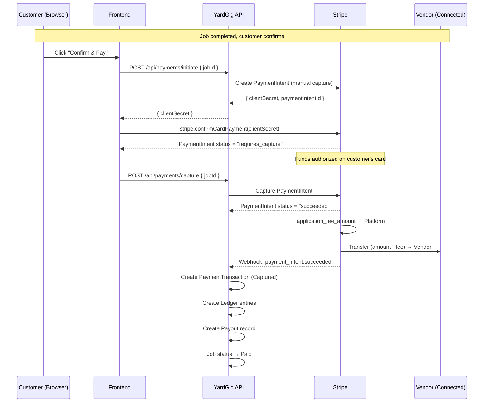
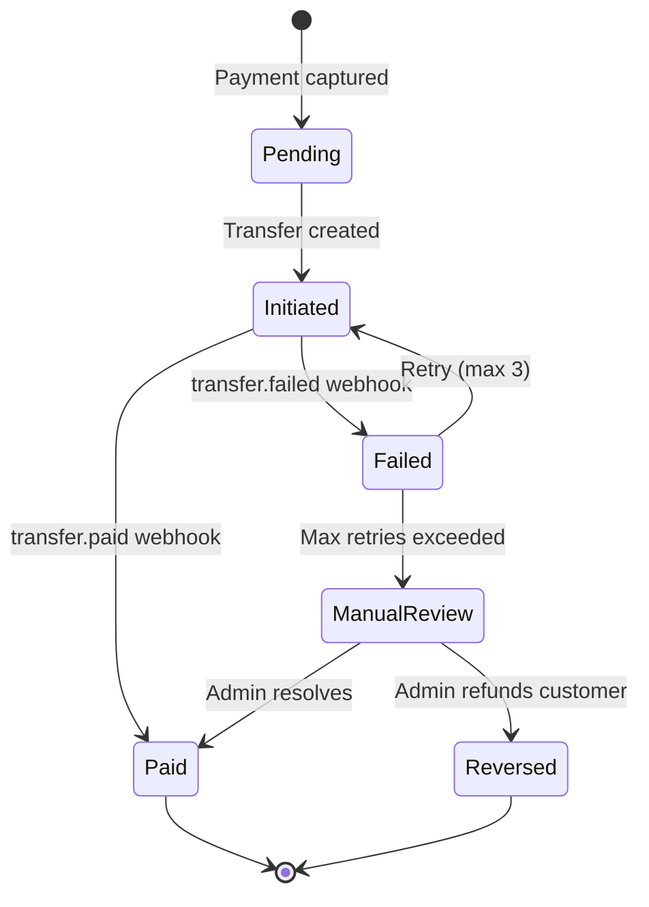
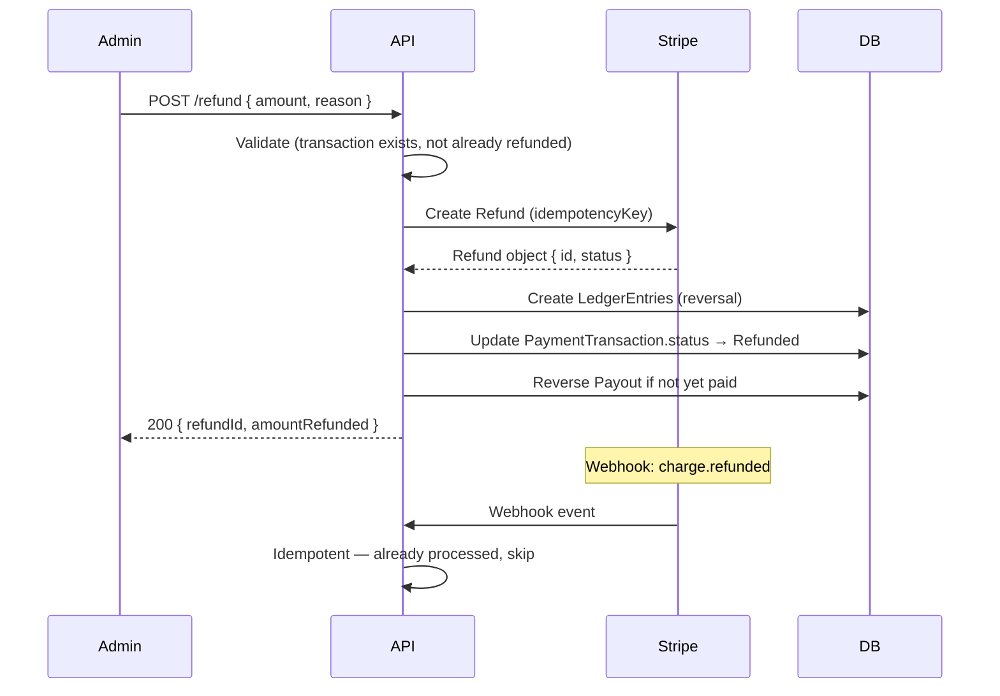

# Payment Integration & Platform Commission — Technical Specification

## 1. Stripe Connect Account Model

### 1.1 Platform Architecture

YardGig uses **Stripe Connect** with the **Destination Charges** model:

```
┌─────────────┐         ┌──────────────────┐         ┌─────────────┐
│  Customer   │────$────▶│  YardGig Platform │────$────▶│   Vendor    │
│ (card)      │         │  (Stripe Account) │         │ (Connected) │
└─────────────┘         └──────────────────┘         └─────────────┘
                              │                              ▲
                              │ application_fee_amount       │ transfer
                              ▼                              │
                         Platform Revenue              Vendor Payout
```

**Why Destination Charges:**
- Customer sees "YardGig" on their statement (brand trust).
- Platform collects full payment, then splits to vendor.
- Platform controls refund logic.
- Simplifies PCI compliance (Stripe.js handles card data).

### 1.2 Vendor Stripe Account Lifecycle

| Stage | Action | API Call |
|-------|--------|---------|
| 1. Registration | Vendor signs up on YardGig | — |
| 2. Onboarding | Redirect to Stripe Connect onboarding | `POST /v1/accounts` (type: express) |
| 3. Verification | Vendor completes Stripe identity checks | Stripe hosted onboarding flow |
| 4. Active | `charges_enabled = true` | Webhook: `account.updated` |
| 5. Payouts | Automatic per Stripe schedule | Configured in connected account |

**Connected Account Type: Express**
- Stripe hosts the onboarding UI (KYC, bank details, tax info).
- Vendor manages their own Stripe dashboard for payouts.
- Platform retains control over charges and refunds.

### 1.3 Vendor Onboarding API

```
POST /api/vendors/stripe/onboard
→ Creates Stripe Express account
→ Returns { accountId, onboardingUrl }
→ Vendor redirects to Stripe-hosted onboarding

GET /api/vendors/stripe/status
→ Returns { chargesEnabled, payoutsEnabled, detailsSubmitted }
```

**Webhook: `account.updated`**
- When `charges_enabled` flips to `true`, update `VendorProfile.StripeAccountId` and mark as payout-ready.

---

## 2. Payment Flow — Authorization, Capture & Webhooks

### 2.1 Payment Intent Lifecycle



### 2.2 Two-Phase Payment (Authorize → Capture)

| Phase | Timing | Purpose |
|-------|--------|---------|
| **Authorize** | When customer clicks "Confirm & Pay" | Validates card, reserves funds (no charge yet) |
| **Capture** | After 1-second confirmation delay | Actually charges the card and initiates transfer |

**Authorization hold window:** 7 days (Stripe default). If not captured within 7 days, authorization expires and funds are released.

**Why two-phase:**
- Allows cancellation between auth and capture.
- Prevents charging for disputed work.
- Customer sees a pending charge immediately (confidence).

### 2.3 Webhook Events

| Event | Action |
|-------|--------|
| `payment_intent.succeeded` | Confirm PaymentTransaction → Captured; initiate payout |
| `payment_intent.payment_failed` | Mark PaymentTransaction → Failed; notify customer |
| `payment_intent.canceled` | Mark PaymentTransaction → Cancelled |
| `charge.refunded` | Create refund ledger entry; update PaymentTransaction |
| `charge.dispute.created` | Create Dispute record; freeze payout; notify admin |
| `charge.dispute.closed` | Update Dispute resolution; release/refund funds |
| `transfer.created` | Confirm Payout → Paid |
| `transfer.failed` | Mark Payout → Failed; retry logic |
| `account.updated` | Update vendor onboarding status |

### 2.4 Webhook Security

```csharp
// Verify webhook signature
var json = await new StreamReader(HttpContext.Request.Body).ReadToEndAsync();
var stripeEvent = EventUtility.ConstructEvent(
    json,
    Request.Headers["Stripe-Signature"],
    configuration["Stripe:WebhookSecret"]
);
```

- All webhooks verified using signing secret.
- Events processed idempotently (see §7).
- Webhook endpoint returns 200 immediately; processing is async.

---

## 3. Commission Configuration

### 3.1 Fee Structure

```
Gross Amount (customer pays)
├── Stripe Processing Fee (2.9% + $0.30) — deducted by Stripe
├── Platform Commission (configurable %) — YardGig revenue
└── Vendor Net Payout — what the vendor receives
```

### 3.2 Commission Rates

| Scope | Rate | Override |
|-------|------|---------|
| **Global default** | 15% | `PlatformSettings.DefaultCommissionRate` |
| **Category override** | Varies | `CategoryCommission` table |
| **Vendor-specific** | Varies | `VendorProfile.CustomCommissionRate` (for preferred vendors) |
| **Promotional** | Reduced | Time-limited promo via `PromotionRule` entity |

**Resolution priority:** Vendor-specific > Category > Global default

### 3.3 Category Commission Table

| Category | Commission | Rationale |
|----------|-----------|-----------|
| Mowing | 15% | Standard |
| Snow clearing | 12% | Seasonal, competitive market |
| Hedge trimming | 15% | Standard |
| Leaf removal | 15% | Standard |
| General yard work | 18% | Higher support cost |

### 3.4 Commission Calculation

```csharp
public record FeeBreakdown(
    int GrossAmountCents,        // What customer pays
    int StripeFeeEstimateCents,  // 2.9% + 30¢ (estimated, actual from Stripe)
    int PlatformFeeCents,        // Commission
    int VendorNetCents           // Vendor receives
);

// Calculation:
var commissionRate = GetEffectiveRate(vendorProfile, jobCategories);
var platformFeeCents = (int)Math.Ceiling(grossCents * commissionRate);
var vendorNetCents = grossCents - platformFeeCents;
// Note: Stripe processing fee is deducted from the application_fee_amount
// by default, so platform bears it. Or configure Stripe to pass to customer.
```

### 3.5 Commission Configuration Entity

```csharp
public class CommissionConfig
{
    public Guid Id { get; set; }
    public string Scope { get; set; }       // "global", "category", "vendor"
    public string? ScopeKey { get; set; }   // category name or vendor profile ID
    public decimal Rate { get; set; }       // 0.15 = 15%
    public DateTime EffectiveFrom { get; set; }
    public DateTime? EffectiveTo { get; set; }
    public bool IsActive { get; set; } = true;
}
```

---

## 4. Ledger Schema

### 4.1 Double-Entry Ledger Design

Every payment event creates balanced ledger entries. The ledger is **append-only** — corrections are made with compensating entries, never updates.

### 4.2 Ledger Entry Entity

```csharp
public class LedgerEntry
{
    public long Id { get; set; }                    // Sequential, never gaps
    public Guid PaymentTransactionId { get; set; }
    public string EntryType { get; set; }           // See table below
    public string Account { get; set; }             // "platform_revenue", "vendor_payable", etc.
    public int DebitCents { get; set; }             // Money in to this account
    public int CreditCents { get; set; }            // Money out of this account
    public string Currency { get; set; } = "usd";
    public string? Description { get; set; }
    public string? IdempotencyKey { get; set; }     // Prevents duplicate entries
    public Guid? RelatedEntityId { get; set; }      // JobRequest, Payout, etc.
    public DateTime CreatedAt { get; set; }
}
```

### 4.3 Accounts

| Account | Description |
|---------|-------------|
| `customer_charge` | Customer payment received |
| `platform_revenue` | Platform commission earned |
| `stripe_fees` | Processing fees paid to Stripe |
| `vendor_payable` | Amount owed to vendor |
| `vendor_paid` | Amount transferred to vendor |
| `refund_liability` | Refunds issued |
| `dispute_hold` | Funds frozen during dispute |

### 4.4 Entry Types & Journal Patterns

#### Payment Captured (happy path)

| # | Entry Type | Account | Debit | Credit | Example ($100 job, 15% commission) |
|---|-----------|---------|-------|--------|-------------------------------------|
| 1 | `payment_received` | `customer_charge` | $100.00 | — | Customer charged |
| 2 | `platform_fee` | `platform_revenue` | $15.00 | — | Commission earned |
| 3 | `stripe_fee` | `stripe_fees` | — | $3.20 | Stripe processing (2.9% + $0.30) |
| 4 | `vendor_earned` | `vendor_payable` | $85.00 | — | Vendor is owed |

**Balanced:** Debits = $200.00, Credits = $3.20 + implicit balance offset (simplified single-entry for MVP, full double-entry in production).

#### Payout to Vendor

| # | Entry Type | Account | Debit | Credit |
|---|-----------|---------|-------|--------|
| 5 | `vendor_payout` | `vendor_payable` | — | $85.00 |
| 6 | `vendor_payout` | `vendor_paid` | $85.00 | — |

#### Full Refund

| # | Entry Type | Account | Debit | Credit |
|---|-----------|---------|-------|--------|
| 7 | `refund_issued` | `customer_charge` | — | $100.00 |
| 8 | `refund_fee_reversal` | `platform_revenue` | — | $15.00 |
| 9 | `refund_vendor_clawback` | `vendor_payable` | — | $85.00 |
| 10 | `refund_liability` | `refund_liability` | $100.00 | — |

#### Partial Refund (50%)

| # | Entry Type | Account | Debit | Credit |
|---|-----------|---------|-------|--------|
| 7 | `partial_refund` | `customer_charge` | — | $50.00 |
| 8 | `partial_fee_reversal` | `platform_revenue` | — | $7.50 |
| 9 | `partial_vendor_clawback` | `vendor_payable` | — | $42.50 |

---

## 5. Payout Schedules & Failure Handling

### 5.1 Payout Timing

| Trigger | Payout Initiated |
|---------|-----------------|
| Payment captured successfully | Immediately (Stripe Transfer) |
| Vendor's Stripe payout schedule | Daily automatic (Stripe handles bank transfer) |

**Two-level payout:**
1. **Platform → Vendor Stripe Account:** Instant (via `Transfer` at capture time).
2. **Vendor Stripe Account → Bank:** Per Stripe's schedule (usually T+2 business days).

### 5.2 Payout States



### 5.3 Failure Handling

| Failure Type | Detection | Response |
|-------------|-----------|----------|
| Transfer failed (bank issue) | `transfer.failed` webhook | Retry after 24h; notify vendor to check bank info |
| Insufficient platform balance | Transfer API 402 | Queue for retry when balance recovers |
| Vendor account restricted | `account.updated` (restricted) | Hold payout; notify admin and vendor |
| Stripe outage | HTTP timeout / 5xx | Exponential backoff: 1s, 5s, 30s, 5min |

### 5.4 Retry Policy

```csharp
public class PayoutRetryPolicy
{
    public int MaxAttempts => 3;
    public TimeSpan[] Delays => [
        TimeSpan.FromHours(1),
        TimeSpan.FromHours(24),
        TimeSpan.FromHours(72)
    ];
}
```

After 3 failures:
1. Payout marked `ManualReview`.
2. Admin notified via dashboard alert.
3. Vendor notified: "Payout delayed. Please verify your bank details."

---

## 6. Refund Flows

### 6.1 Refund Scenarios

| Scenario | Refund Type | Who Initiates | Commission Refunded? |
|----------|-------------|---------------|---------------------|
| Customer cancels (late, after payment) | Full | Admin | Yes |
| Work not completed satisfactorily | Partial (50-100%) | Admin | Proportional |
| Vendor no-show | Full | System/Admin | Yes |
| Stripe dispute (chargeback) | Full | Stripe | Yes (forced) |
| Duplicate charge | Full | Admin | Yes |

### 6.2 Refund API

```
POST /api/admin/payments/{transactionId}/refund
{
  "amountCents": 5000,  // null = full refund
  "reason": "work_not_satisfactory",
  "notifyCustomer": true,
  "notifyVendor": true
}
```

### 6.3 Refund Processing



### 6.4 Clawback Logic

If vendor was already paid (Transfer completed):
- Platform issues a **Transfer Reversal** to pull funds back from vendor's connected account.
- If vendor balance insufficient → marked as negative balance; recovered from future payouts.

---

## 7. Idempotency & Retry Strategy

### 7.1 Idempotency Keys

Every Stripe API call includes an idempotency key to prevent duplicate charges:

```csharp
var requestOptions = new RequestOptions
{
    IdempotencyKey = $"pi_{jobId}_{transactionAttempt}"
};
```

| Operation | Idempotency Key Format |
|-----------|----------------------|
| Create PaymentIntent | `pi_create_{jobId}` |
| Capture PaymentIntent | `pi_capture_{paymentIntentId}` |
| Create Transfer | `xfer_{paymentTransactionId}` |
| Create Refund | `ref_{paymentTransactionId}_{amount}` |

### 7.2 Webhook Idempotency

```csharp
// Check if event already processed
var alreadyProcessed = await db.ProcessedWebhookEvents
    .AnyAsync(e => e.StripeEventId == stripeEvent.Id);

if (alreadyProcessed) return Ok(); // Acknowledge without reprocessing
```

**ProcessedWebhookEvent table:**
```sql
CREATE TABLE "ProcessedWebhookEvents" (
    stripe_event_id VARCHAR(100) PRIMARY KEY,
    event_type VARCHAR(50) NOT NULL,
    processed_at TIMESTAMPTZ NOT NULL DEFAULT now()
);
```

### 7.3 Retry Strategy for API Calls

| Scenario | Strategy |
|----------|----------|
| Stripe 429 (rate limit) | Backoff using `Retry-After` header |
| Stripe 5xx | Exponential backoff: 1s, 2s, 4s, 8s (max 4 retries) |
| Network timeout | Retry once immediately, then backoff |
| 402 (insufficient funds) | Don't retry; notify admin |
| 4xx (client error) | Don't retry; log and alert |

### 7.4 At-Least-Once Processing

All payment operations are designed for **at-least-once** semantics:
- Idempotency keys prevent duplicate Stripe operations.
- Ledger entries check for existing entries before inserting.
- Webhook handler checks `ProcessedWebhookEvents` table.
- Database transactions ensure atomicity within our system.

---

## 8. Reconciliation Procedures

### 8.1 Daily Reconciliation Job

**Schedule:** Daily at 02:00 UTC

**Steps:**
1. Fetch all PaymentTransactions from past 24h.
2. For each, call Stripe API to get current PaymentIntent status.
3. Compare local status vs Stripe status.
4. Flag discrepancies in `ReconciliationReport` table.
5. Auto-fix safe discrepancies (e.g., webhook missed).
6. Alert admin for unsafe discrepancies.

### 8.2 Reconciliation Checks

| Check | Expected | Alert If |
|-------|----------|----------|
| Local `Captured` → Stripe `succeeded` | Match | Stripe shows different status |
| Local `Pending` older than 1h | Should be captured or failed | Still pending (stuck) |
| Payout `Initiated` older than 7 days | Should be `Paid` | Transfer stuck |
| Ledger balance | Debits = Credits (per job) | Imbalanced entries |
| Platform revenue (Stripe) vs ledger sum | Match within $1 | Drift > $1 |

### 8.3 Monthly Financial Report

```sql
-- Monthly platform revenue
SELECT 
    date_trunc('month', created_at) AS month,
    SUM(CASE WHEN entry_type = 'platform_fee' THEN debit_cents ELSE 0 END) AS gross_revenue,
    SUM(CASE WHEN entry_type = 'stripe_fee' THEN credit_cents ELSE 0 END) AS stripe_fees,
    SUM(CASE WHEN entry_type LIKE 'refund%' THEN credit_cents ELSE 0 END) AS refunds
FROM "LedgerEntries"
GROUP BY month
ORDER BY month DESC;
```

---

## 9. API Endpoints — Complete Payment Surface

| Method | Endpoint | Actor | Description |
|--------|----------|-------|-------------|
| POST | `/api/payments/initiate` | Customer | Create PaymentIntent (authorize) |
| POST | `/api/payments/capture` | Customer | Capture authorized payment |
| GET | `/api/payments/job/{jobId}` | Customer/Vendor | Get payment status for a job |
| POST | `/api/vendors/stripe/onboard` | Vendor | Start Stripe Connect onboarding |
| GET | `/api/vendors/stripe/status` | Vendor | Check onboarding status |
| GET | `/api/vendors/stripe/dashboard` | Vendor | Get Stripe Express dashboard link |
| POST | `/api/admin/payments/{id}/refund` | Admin | Issue full or partial refund |
| GET | `/api/admin/payments/reconciliation` | Admin | View reconciliation report |
| POST | `/api/webhooks/stripe` | Stripe | Receive webhook events |

---

## 10. Security & Compliance

| Concern | Mitigation |
|---------|-----------|
| PCI DSS | Stripe.js / Elements handles all card data; never touches our servers |
| Webhook authenticity | Verify `Stripe-Signature` header against webhook secret |
| Idempotent charges | Idempotency keys on all create operations |
| Refund fraud | Only admin can issue refunds; audit logged |
| Vendor payout fraud | Connected accounts verified via Stripe KYC |
| Statement descriptor | "YARDGIG*{JOB_TITLE}" (max 22 chars) |
| Currency | USD only at MVP; multi-currency post-MVP |
| Minimum charge | $1.00 (Stripe minimum for US) |
| Maximum charge | $10,000 (platform limit) |
