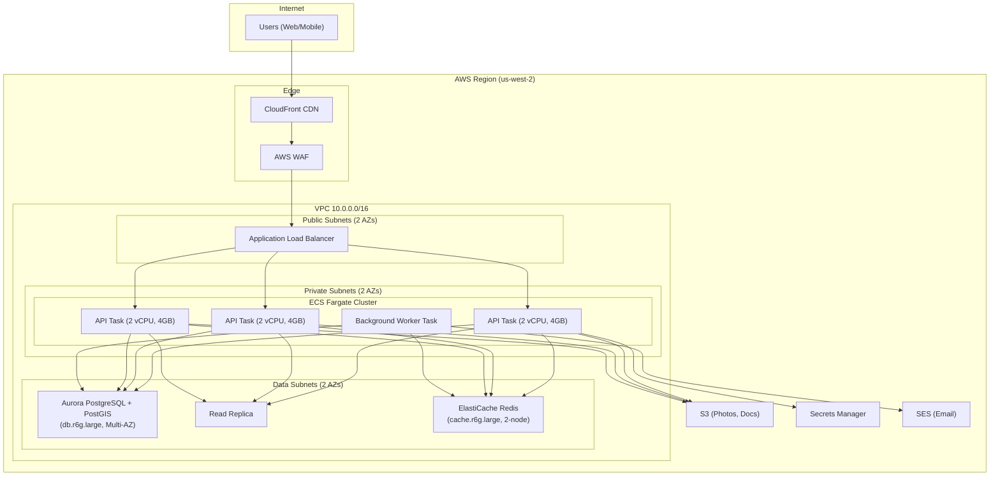
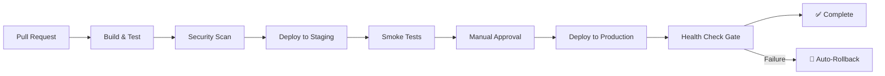

# Production Readiness & Scale — Technical Specification

## 1. SLO / SLA Targets

### 1.1 Service Level Objectives

| SLO | Target | Measurement | Burn Rate Alert |
|-----|--------|-------------|-----------------|
| **Availability** | 99.5% monthly (≤ 3.6h downtime) | Synthetic health checks every 30s | > 2% error budget consumed in 1h |
| **API Latency (p50)** | ≤ 100ms | OpenTelemetry histogram | — |
| **API Latency (p95)** | ≤ 500ms | OpenTelemetry histogram | > 750ms for 5min |
| **API Latency (p99)** | ≤ 2000ms | OpenTelemetry histogram | > 3000ms for 2min |
| **Map Query Latency (p95)** | ≤ 200ms | Custom metric on `/api/jobs/map` | > 400ms for 5min |
| **Error Rate** | < 0.5% of requests | 5xx response count / total | > 1% for 5min |
| **Payment Success Rate** | ≥ 99.0% | Captured / Attempted | < 97% for 15min |
| **Notification Delivery** | ≥ 95% within 60s | Outbox sent_at - created_at | > 120s median for 10min |
| **SignalR Push Latency** | ≤ 1s | Event publish → client receive | > 3s for 5min |

### 1.2 SLA (External Commitment)

| Tier | Availability | Support Response | Credits |
|------|-------------|-----------------|---------|
| Standard | 99.0% monthly | 24h business hours | 10% per 0.1% below |
| Premium | 99.5% monthly | 4h 24/7 | 25% per 0.1% below |

### 1.3 Error Budget Policy

- **Monthly budget:** 0.5% = ~219 minutes of allowed downtime.
- **If budget is < 25% remaining:** Freeze non-critical deployments; focus on stability.
- **If budget is exhausted:** Rollback recent changes; war-room until restored.

---

## 2. Observability Dashboard Specification

### 2.1 Tooling Stack

| Layer | Tool | Purpose |
|-------|------|---------|
| Metrics | Prometheus + Grafana | Counters, histograms, gauges |
| Logs | Serilog → OpenTelemetry → Loki (or CloudWatch) | Structured JSON logs |
| Traces | OpenTelemetry → Jaeger (or AWS X-Ray) | Distributed request tracing |
| Alerting | Grafana Alerting → PagerDuty | On-call rotation |
| Uptime | External synthetic (Pingdom/UptimeRobot) | Public health check |

### 2.2 Dashboard Panels

**Dashboard 1: Platform Health**
```
┌─────────────────────────────────────────────────────┐
│ Request Rate (req/s)  │  Error Rate (%)  │  Uptime  │
│ ████████████ 234/s    │  ▁▁▁▂▁ 0.3%     │  99.7%   │
├───────────────────────┼──────────────────┼──────────┤
│ p50 Latency: 45ms    │  p95: 320ms      │ p99: 1.2s│
├───────────────────────┴──────────────────┴──────────┤
│ Active Connections: 1,247  │  SignalR Hubs: 892      │
│ DB Pool Active: 18/100     │  Redis Mem: 245 MB      │
└─────────────────────────────────────────────────────┘
```

**Dashboard 2: Business Metrics**
```
┌──────────────────────────────────────────────┐
│ Jobs/hour  │  Payments/hour  │  Active Users │
│ 47         │  12             │  1,847        │
├──────────────────────────────────────────────┤
│ Map Query Latency (p95): 142ms               │
│ Notification Outbox Depth: 23                │
│ Failed Payouts: 0                            │
│ Dead Letter Queue: 0                         │
└──────────────────────────────────────────────┘
```

**Dashboard 3: Infrastructure**
```
┌──────────────────────────────────────────────┐
│ CPU (per pod)  │  Memory  │  DB Connections  │
│ ▅▆▇▅▃ 42%     │  1.2 GB  │  Active: 24/100  │
├──────────────────────────────────────────────┤
│ PostgreSQL: Queries/s, Slow queries, Locks   │
│ Redis: Hit rate, Memory, Connected clients   │
│ Pod count: 3/3 healthy                       │
└──────────────────────────────────────────────┘
```

### 2.3 Key Metrics to Instrument

```csharp
// Custom metrics (Prometheus via OpenTelemetry)
Meter meter = new("YardGig.Api");

Counter<long> jobsCreated = meter.CreateCounter<long>("yardgig_jobs_created_total");
Counter<long> paymentsProcessed = meter.CreateCounter<long>("yardgig_payments_total", tags: ["status"]);
Histogram<double> mapQueryDuration = meter.CreateHistogram<double>("yardgig_map_query_duration_seconds");
Gauge<int> signalrConnections = meter.CreateGauge<int>("yardgig_signalr_connections");
Counter<long> notificationsSent = meter.CreateCounter<long>("yardgig_notifications_sent_total", tags: ["channel", "status"]);
Gauge<int> outboxDepth = meter.CreateGauge<int>("yardgig_notification_outbox_depth");
```

---

## 3. Infrastructure Topology

### 3.1 Production Architecture (AWS)



### 3.2 Component Sizing (Launch)

| Component | Size | Count | Cost/mo (est.) |
|-----------|------|-------|----------------|
| ECS Fargate (API) | 2 vCPU, 4 GB | 3 tasks | $290 |
| ECS Fargate (Worker) | 1 vCPU, 2 GB | 1 task | $50 |
| Aurora PostgreSQL | db.r6g.large (2 vCPU, 16 GB) | Primary + Replica | $460 |
| ElastiCache Redis | cache.r6g.large (2 vCPU, 13 GB) | 2-node cluster | $280 |
| ALB | — | 1 | $25 |
| CloudFront | 100 GB/mo | 1 distribution | $10 |
| S3 | 50 GB stored | 1 bucket | $2 |
| Secrets Manager | 10 secrets | — | $5 |
| **Total** | | | **~$1,122/mo** |

### 3.3 Scaling Triggers

| Metric | Scale Out | Scale In | Min | Max |
|--------|-----------|----------|-----|-----|
| CPU (ECS) | > 65% for 3min | < 30% for 10min | 3 | 12 |
| Request count | > 500 req/s | < 100 req/s | 3 | 12 |
| Queue depth (outbox) | > 500 pending | < 50 pending | 1 worker | 4 workers |

---

## 4. Capacity Planning Assumptions

### 4.1 Launch Targets (Month 1-3)

| Metric | Target | Infrastructure Impact |
|--------|--------|----------------------|
| Registered users | 5,000 | Minimal DB load |
| Concurrent users | 500 | 3 API instances sufficient |
| Jobs created/day | 200 | ~8/hour; trivial write load |
| Open jobs on map | 500-2,000 | PostGIS query under 50ms |
| Payments/day | 50 | Stripe rate limits: no issue |
| Notifications/day | 5,000 | Outbox handles easily |

### 4.2 Growth Targets (Month 6-12)

| Metric | Target | Infrastructure Changes |
|--------|--------|----------------------|
| Registered users | 50,000 | Add read replica |
| Concurrent users | 5,000 | Scale to 6-8 API instances |
| Jobs created/day | 2,000 | Connection pooling (PgBouncer) |
| Open jobs on map | 10,000-50,000 | Redis cache layer for map queries |
| Payments/day | 500 | No changes needed |
| Notifications/day | 100,000 | Scale worker to 3 instances |

### 4.3 Database Growth

| Table | Row Growth/Month | Size at 12mo | Partitioning |
|-------|-----------------|-------------|--------------|
| JobRequests | 60,000 | ~500 MB | None (manageable) |
| VendorRequests | 300,000 | ~1 GB | None |
| PaymentTransactions | 15,000 | ~200 MB | None |
| LedgerEntries | 60,000 | ~500 MB | None |
| Notifications | 3,000,000 | ~5 GB | Range by month |
| NotificationOutbox | 3,000,000 (purged) | ~1 GB active | Purge after 30 days |
| AuditEntries | 100,000 | ~500 MB | Range by month |

---

## 5. Incident Response Runbook

### 5.1 Severity Levels

| Level | Impact | Response Time | Example |
|-------|--------|---------------|---------|
| **SEV1** | Full outage; payments broken | 15 min (page on-call) | Database down; Stripe integration failure |
| **SEV2** | Partial outage; degraded service | 30 min (page on-call) | Map queries slow; one AZ down |
| **SEV3** | Minor impact; workaround exists | 4h (business hours) | Push notifications delayed; minor UI bug |
| **SEV4** | No user impact | Next sprint | Logging gap; non-critical background job failure |

### 5.2 Runbook: Database Unresponsive (SEV1)

```
1. DETECT: Health check fails → ALB marks targets unhealthy → PagerDuty alert
2. TRIAGE (5 min):
   - Check RDS console: CPU, connections, storage
   - Check CloudWatch: Is it a failover? Network issue?
   - Check if read replica is healthy (failover candidate)
3. MITIGATE (10 min):
   - If connection exhaustion: Kill idle connections; restart API pods
   - If disk full: Enable auto-scaling storage; delete old partitions
   - If primary down: Initiate Aurora failover to replica
4. COMMUNICATE: Post to status page within 15 min
5. RESOLVE: Root cause fix
6. POST-MORTEM: Within 48h; blameless review; action items
```

### 5.3 Runbook: Payment Processing Failure (SEV1)

```
1. DETECT: payment.failed webhook spike OR customer complaints
2. TRIAGE:
   - Check Stripe status page (status.stripe.com)
   - Check webhook delivery logs in Stripe dashboard
   - Check our API logs for Stripe SDK exceptions
3. MITIGATE:
   - If Stripe down: Disable payment capture; show "payment processing delayed"
   - If our integration broken: Rollback recent deployment
   - If card declines: Normal behavior; no action
4. RECOVERY:
   - Run reconciliation job to catch missed webhooks
   - Retry failed PaymentTransactions
   - Notify affected customers
```

### 5.4 Runbook: Map Queries Degraded (SEV2)

```
1. DETECT: map_query_duration_seconds p95 > 500ms for 5min
2. TRIAGE:
   - Check PostGIS index usage: pg_stat_user_indexes
   - Check open job count (sudden spike?)
   - Check DB CPU / connection count
3. MITIGATE:
   - Enable aggressive Redis caching (TTL 30s → 5s staleness acceptable)
   - Reduce default limit from 200 to 100 pins
   - If index corruption: REINDEX CONCURRENTLY
4. RESOLVE: Optimize query; add covering index; scale read replica
```

### 5.5 Runbook: Notification Backlog (SEV3)

```
1. DETECT: outbox_depth > 1000 for > 10min
2. TRIAGE:
   - Check provider status (SendGrid, FCM)
   - Check dead letter count (circuit breaker tripped?)
   - Check worker task health
3. MITIGATE:
   - Scale worker tasks: 1 → 4
   - If provider down: Skip channel; defer to retry
   - If worker crashed: Restart task
4. RESOLVE: Fix provider integration; tune batch sizes
```

### 5.6 On-Call Rotation

| Role | Schedule | Escalation After |
|------|----------|-----------------|
| Primary on-call | Weekly rotation, 24/7 | — |
| Secondary on-call | Backup if primary unreachable | 10 min |
| Engineering Manager | Escalation for SEV1 > 30min | Auto |

---

## 6. Backup, Restore & Disaster Recovery

### 6.1 Backup Strategy

| Component | Method | Frequency | Retention | RPO |
|-----------|--------|-----------|-----------|-----|
| Aurora PostgreSQL | Automated snapshots | Continuous (PITR) | 35 days | 5 minutes |
| Aurora PostgreSQL | Manual snapshot | Weekly (Sunday 03:00 UTC) | 90 days | 1 week |
| Redis | RDB snapshot | Every 6 hours | 7 days | 6 hours |
| S3 (photos/docs) | Versioning + Cross-region replication | Real-time | Indefinite | 0 (replicated) |
| Secrets Manager | Versioned; multi-region | Real-time | 30 versions | 0 |
| Application Config | Git (IaC) | Every commit | Indefinite | 0 |

### 6.2 Recovery Targets

| Scenario | RTO | RPO | Strategy |
|----------|-----|-----|----------|
| Single AZ failure | 0 (automatic) | 0 | Multi-AZ Aurora + ECS spread |
| Database corruption | < 30 min | 5 min | Aurora PITR |
| Accidental data deletion | < 1h | 5 min | PITR to pre-deletion timestamp |
| Full region outage | < 4h | 5 min | Cross-region Aurora replica + Route53 failover |
| Ransomware / total compromise | < 24h | 1 week | Weekly manual snapshot in separate account |

### 6.3 Disaster Recovery Test Plan

| Test | Frequency | Procedure | Success Criteria |
|------|-----------|-----------|-----------------|
| Failover test | Monthly | Trigger Aurora failover; verify app reconnects | < 30s downtime; no data loss |
| PITR restore test | Quarterly | Restore to new cluster from point-in-time | All data present; app connects successfully |
| Full DR drill | Semi-annually | Fail entire primary region; activate secondary | Service operational in < 4h; RTO met |
| Backup verification | Weekly (automated) | Restore latest snapshot to test cluster; run integrity checks | All tables present; row counts match within RPO |
| Secret rotation test | Quarterly | Rotate all secrets; verify zero-downtime | No authentication failures during rotation |

### 6.4 Data Integrity Checks (Automated)

```sql
-- Daily integrity check job
-- 1. Ledger balance check (debits should equal credits per transaction)
SELECT pt.id, SUM(le.debit_cents) - SUM(le.credit_cents) AS imbalance
FROM "PaymentTransactions" pt
JOIN "LedgerEntries" le ON le."PaymentTransactionId" = pt.id
GROUP BY pt.id
HAVING SUM(le.debit_cents) != SUM(le.credit_cents);

-- 2. Orphaned assignments (assignment without job)
SELECT ja.id FROM "JobAssignments" ja
LEFT JOIN "JobRequests" jr ON jr.id = ja."JobRequestId"
WHERE jr.id IS NULL;

-- 3. Status consistency (Paid jobs must have PaymentTransaction)
SELECT jr.id FROM "JobRequests" jr
LEFT JOIN "PaymentTransactions" pt ON pt."JobRequestId" = jr.id AND pt."Status" = 'Captured'
WHERE jr."Status" = 'Paid' AND pt.id IS NULL;
```

---

## 7. CI/CD Pipeline

### 7.1 Pipeline Stages



### 7.2 Build & Test Stage

```yaml
# GitHub Actions / AWS CodePipeline
steps:
  - dotnet restore
  - dotnet build --no-restore
  - dotnet test --no-build --collect:"XPlat Code Coverage"
  - dotnet publish -c Release -o ./publish
  - docker build -t yardgig-api:${SHA} .
  - docker push ECR/yardgig-api:${SHA}
```

### 7.3 Quality Gates

| Gate | Threshold | Blocks Deploy? |
|------|-----------|---------------|
| Unit tests pass | 100% | ✅ |
| Code coverage | ≥ 70% | ⚠️ Warning only |
| SAST (Snyk/Semgrep) | No critical/high | ✅ |
| Dependency audit | No known critical CVEs | ✅ |
| Container scan (Trivy) | No critical vulnerabilities | ✅ |
| Integration tests (staging) | 100% pass | ✅ |
| Performance regression | < 10% latency increase | ⚠️ Warning |

### 7.4 Blue-Green Deployment

```
┌─────────────────────────────────────────────────┐
│                  ALB (Production)                 │
│  ┌──────────────────┐  ┌──────────────────┐    │
│  │  Target Group A  │  │  Target Group B  │    │
│  │  (BLUE - Live)   │  │  (GREEN - New)   │    │
│  │  v1.4.2          │  │  v1.5.0          │    │
│  └──────────────────┘  └──────────────────┘    │
│         100% ──────────────▶ 0%                  │
│                                                   │
│  After health check passes (5 min):              │
│         0% ───────────────▶ 100%                 │
│         (drain) ──────────▶ (active)             │
└─────────────────────────────────────────────────┘
```

**Deployment Steps:**
1. Deploy new version to GREEN target group.
2. Run health checks against GREEN (internal ALB rule).
3. Shift 10% traffic to GREEN (canary).
4. Monitor error rate for 5 minutes.
5. If healthy → shift 100% to GREEN.
6. If errors → immediate rollback to BLUE.
7. Drain BLUE after 15 minutes (inflight requests complete).
8. Deregister BLUE tasks.

### 7.5 Rollback Procedures

| Scenario | Action | Time | Method |
|----------|--------|------|--------|
| Failed health check (auto) | Shift traffic back to BLUE | < 30s | ALB listener rule |
| Error spike post-deploy | Manual rollback via CLI | < 2min | `aws ecs update-service --task-definition prev` |
| Database migration failure | Restore from pre-migration snapshot | < 30min | Aurora PITR |
| Configuration error | Revert Secrets Manager version | < 1min | `aws secretsmanager put-secret-value --version-stage PREVIOUS` |

### 7.6 Database Migration Strategy

- **Forward-only migrations** (no down migrations in production).
- **Expand/Contract pattern:**
  1. Add new column (nullable) — deploy migration.
  2. Deploy code that writes to both old and new columns.
  3. Backfill new column.
  4. Deploy code that reads from new column only.
  5. Drop old column (next release).
- **Zero-downtime requirement:** All migrations must be backward-compatible with the previous app version.

---

## 8. Redis Caching Strategy

### 8.1 Cache Layers

| Data | Key Pattern | TTL | Invalidation |
|------|-------------|-----|-------------|
| Map pin query results | `map:{boundsHash}:{filtersHash}` | 10s | On job create/assign/cancel |
| User profile | `user:{userId}` | 5min | On profile update |
| Vendor profile | `vendor:{vendorId}` | 5min | On profile update |
| Job detail | `job:{jobId}` | 30s | On any job state change |
| Commission rates | `commission:effective` | 1h | On admin commission change |
| Session/token blocklist | `token:revoked:{jti}` | 15min (token lifetime) | Never (auto-expires) |
| Rate limit counters | `ratelimit:{ip}:{window}` | Window duration | Auto-expiry |

### 8.2 Cache-Aside Pattern

```csharp
public async Task<List<MapPinDto>> GetMapPinsAsync(BoundsQuery query)
{
    var cacheKey = $"map:{query.GetHashCode()}";
    var cached = await redis.GetAsync<List<MapPinDto>>(cacheKey);
    if (cached is not null) return cached;

    var result = await db.QueryAsync(query);
    await redis.SetAsync(cacheKey, result, TimeSpan.FromSeconds(10));
    return result;
}
```

### 8.3 Cache Invalidation Events

| Domain Event | Invalidation Action |
|-------------|-------------------|
| `JobCreatedEvent` | Delete all `map:*` keys (area-specific in production) |
| `JobAssignedEvent` | Delete `map:*`; Delete `job:{jobId}` |
| `VendorVerifiedEvent` | Delete `vendor:{vendorId}` |
| Profile updated | Delete `user:{userId}` or `vendor:{vendorId}` |
| Commission changed | Delete `commission:effective` |

---

## 9. Health Check Implementation

### 9.1 Health Check Endpoints

| Endpoint | Purpose | Checks |
|----------|---------|--------|
| `/health` | ALB health check (fast) | App is responding |
| `/health/ready` | Readiness probe | DB connection, Redis connection |
| `/health/live` | Liveness probe | App not deadlocked |
| `/health/detailed` | Internal diagnostics (admin only) | All dependencies + versions |

### 9.2 Implementation

```csharp
builder.Services.AddHealthChecks()
    .AddNpgSql(connectionString, name: "postgresql")
    .AddRedis(redisConnection, name: "redis")
    .AddUrlGroup(new Uri("https://api.stripe.com/v1/"), name: "stripe")
    .AddCheck<OutboxHealthCheck>("notification-outbox")
    .AddCheck<SignalRHealthCheck>("signalr");

app.MapHealthChecks("/health/ready", new HealthCheckOptions
{
    Predicate = check => check.Tags.Contains("ready")
});
```

### 9.3 Custom Health Checks

```csharp
// OutboxHealthCheck: fails if >1000 entries pending >10min
public class OutboxHealthCheck : IHealthCheck
{
    public async Task<HealthCheckResult> CheckHealthAsync(...)
    {
        var staleCount = await db.NotificationOutbox
            .CountAsync(e => e.Status == Pending && e.CreatedAt < DateTime.UtcNow.AddMinutes(-10));

        return staleCount > 1000
            ? HealthCheckResult.Degraded($"Outbox backlog: {staleCount} entries")
            : HealthCheckResult.Healthy();
    }
}
```

---

## 10. Security Hardening Checklist

| Category | Control | Status |
|----------|---------|--------|
| Secrets | All in Secrets Manager; rotated quarterly | ✅ |
| TLS | 1.3 enforced; HSTS max-age=31536000 | ✅ |
| WAF | OWASP Core Rule Set; rate limiting; geo-blocking | Configured |
| Container | Non-root user; read-only filesystem; no shell | Dockerfile |
| Network | Private subnets for data; no public DB access | VPC design |
| Dependencies | Snyk scanning; Dependabot auto-PRs | CI pipeline |
| Logging | PII scrubbed; secrets never logged | Serilog filters |
| Backups | Encrypted at rest; separate AWS account for DR | Aurora config |
| Access | MFA required for AWS console; least-privilege IAM | IAM policies |
| Pen testing | Annual third-party assessment | Scheduled |
